<!-- page:1 -->
# MORAN: A Multi-Object Rectified Attention Network
for Scene Text Recognition

arXiv:1901.03003v1  [cs.CV]  10 Jan 2019

Canjie Luo^{†}, Lianwen Jin^{∗†}^{‡}, Zenghui Sun^{†}

School of Electronic and Information Engineering, South China University of Technology^{†}

SCUT-Zhuhai Institute of Modern Industrial Innovation^{‡}

{canjie.luo, lianwen.jin^{∗}, sunfreding}@gmail.com, eelwjin@scut.edu.cn^{∗}

## Abstract

Irregular text is widely used.However, it is
considerably difficult to recognize because of its
various shapes and distorted patterns. In this paper,
we thus propose a multi-object rectified attention
network (MORAN) for general scene text recognition.
The MORAN consists of a multi-object rectification
network and an attention-based sequence recognition
network.The multi-object rectification network is
designed for rectifying images that contain irregu-lar text.It decreases the difficulty of recognition
and enables the attention-based sequence recognition
network to more easily read irregular text.It is
trained in a weak supervision way, thus requiring only
images and corresponding text labels. The attention-based sequence recognition network focuses on target
characters and sequentially outputs the predictions.
Moreover, to improve the sensitivity of the attention-based sequence recognition network, a fractional
pickup method is proposed for an attention-based
decoder in the training phase. With the rectification
mechanism, the MORAN can read both regular and
irregular scene text. Extensive experiments on various
benchmarks are conducted, which show that the
MORAN achieves state-of-the-art performance. The
source code is available^{1}.

Keywords: Scene text recognition, optical charac-ter recognition, deep learning.

(a)

    1. (c)
Figure 1. Examples of regular and irregular scene text. (a)
Regular text. (b) Slanted and perspective text. (c) Curved
text.

(b)

^{∗}Corresponding author
^{1}https://github.com/Canjie-Luo/MORAN_v2

## 1. Introduction

Scene text recognition is an essential process in computer vision tasks.Many practical applications such as traffic sign reading, product recognition, intelligent inspection, and image searching, benefit from the rich semantic information of scene text. With the development of scene text detection methods [11, 26, 46, 56], scene character recognition has emerged at the forefront of this research topic and is regarded as an open and very challenging research problem [45]. Nowadays, regular text recognition methods [3, 33, 41, 45, 50] have achieved notable success.More-over, methods based on convolutional neural networks [3, 22, 50] have been broadly applied.Integrating recognition models with recurrent neural networks [17, 41, 42] and attention mechanisms [5, 6, 27, 51] yields better performance for these models. Nevertheless, most current recognition models re-main too unstable to handle multiple disturbances

<!-- page:2 -->
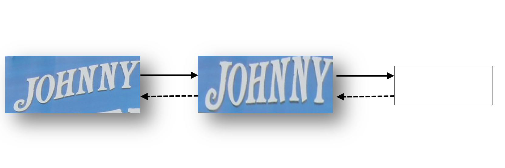

InputRectified ImageImageResult

MORNASRN

JOHNNY

WeakText Label SupervisionSupervision

*Figure 2. Overview of the MORAN. The MORAN contains
a MORN and an ASRN. The image is rectified by the
MORN and given to the ASRN. The dashed lines show the
direction of gradient propagation, indicating that the two
sub-networks are jointly trained.*

```
from the environment.Furthermore, the various
shapes and distorted patterns of irregular text cause
additional challenges in recognition.As illustrated
in Fig. 1, scene text with irregular shapes, such as
perspective and curved text, is still very challenging
to recognize.
Reading text is naturally regarded as a multi-classification task involving sequence-like objects
[41].Usually, the characters in one text are of the
same size. However, characters in different scene texts
can vary in size.Therefore, we propose the multi-object rectified attention network (MORAN), which
can read rotated, scaled and stretched characters in
different scene texts.The MORAN consists of a
multi-object rectification network (MORN) to rectify
images and an attention-based sequence recognition
network (ASRN) to read the text.We separate the
difficult recognition task into two parts.First, as
one kind of spatial transformer, the MORN rectifies
images that contain irregular text. As Fig. 2 shows,
after the rectification by the MORN, the slanted text
becomes more horizontal, tightly-bounded, and easier
to read. Second, ASRN takes the rectified image as
input and outputs the predicted word.
The training of the MORN is guided by the
ASRN, which requires only text labels. Without any
geometric-level or pixel-level supervision, the MORN
is trained in a weak supervision way.To facilitate
this manner of network training, we initialize a basic
coordinate grid. Every pixel of an image has its own
position coordinates. The MORN learns and generates
an offset grid based on these coordinates and samples
the pixel value accordingly to rectify the image. The
rectified image is then obtained for the ASRN.
```

With respect to the ASRN, a decoder with an atten-tion mechanism is more likely to predict the correct words because of the rectified images.However, Cheng et al. [5] found that existing attention-based methods cannot obtain accurate alignments between feature areas and targets.Therefore, we propose a fractional pickup method to train the ASRN. By adopting several scales of stretch on different parts of the feature maps, the feature areas are changed randomly at every iteration in the training phase. Owing to training with fractional pickup, the ASRN is more robust to the variation of context. Experiments show that the ASRN can accurately focus on objects. In addition, we designed a curriculum learning strategy for the training of the MORAN. Because the MORN and ASRN are mutually beneficial in terms of performance, we first fix one of them to more efficiently optimize the other.Finally, the MORN and ASRN are optimized in an end-to-end fashion to improve performance. In short, the contributions of our research are as follows:

    - • We propose the MORAN framework to recognize
irregular scene text. The framework contains a
multi-object rectification network (MORN) and
an attention-based sequence recognition network
(ASRN). The image rectified by the MORN is
more readable for the ASRN.
    - • Trained in a weak supervision way, the sub-network MORN is flexible. It is free of geometric
constraints and can rectify images with compli-cated distortion.
    - • We propose a fractional pickup method for the
training of the attention-based decoder in the
ASRN. To address noise perturbations, we ex-pand the visual field of the MORAN, which
further improves the sensitivity of the attention-based decoder.
    - • We propose a curriculum learning strategy that
enables the MORAN to learn efficiently. Owing
to the training with this strategy, the MORAN
outperforms state-of-the-art methods on several
standard text recognition benchmarks, including
the IIIT5K, SVT, ICDAR2003, ICDAR2013,
ICDAR2015,SVT-Perspective,and CUTE80
datasets.

<!-- page:3 -->
The rest of the paper is organized as follow. Section 2 reviews related work. Section 3 details the proposed method. Experimental results are given in Section 4, and the conclusions are presented in Section 5.

## 2. Related Work

In recent years, the recognition of scene text has greatly advanced because of the rapid development of neural networks [14]. Zhu et al. [57] and Ye et al. [53] have provided an overview of the major advances in the field of scene text detection and recognition. Based on the sliding window method [48, 49], pattern fea-tures extracted by a neural network become dominant with respect to the hand crafted features, such as the connected components [33], strokelet generation [52], histogram of oriented gradients descriptors [10, 44], tree-structured models [43], semi-markov conditional random fields [40] and generative shape models [30]. For instance, Bissacco [3] applied a network with fvie hidden layers for character classification. Using convolutional neural networks (CNNs), Jaderberg et al.[21] and Yin et al.[54] proposed respective methods for unconstrained recognition. With the widespread application of recurrent neural networks (RNNs) [8, 19], CNN-based methods are combined with RNNs for better learning of context information. As a feature extractor, the CNN obtains the spatial features of images. Then, the RNN learns the context of features.Shi et al.[41] proposed an end-to-end trainable network with both CNNs and RNNs, named CRNN. Guided by the CTC loss [13], the CRNN-based network learns the conditional probability between predictions and sequential labels. Furthermore, attention mechanisms [2] focus on informative regions to achieve better performance. Lee et al. [27] proposed a recursive recurrent network with attention modeling for scene text recognition. Yang et al. [51] addressed a two-dimensional attention mechanism.Cheng et al.[5] used the focusing attention network (FAN) to correct shifts in attentional mechanisms and achieved more accurate position predictions. Compared with regular text recognition work, ir-regular text recognition is more difficult. One kind of irregular text recognition method is the bottom-up approach [6, 51], which searches for the position of each character and then connects them. Another is the

top-down approach [28, 42]. This type of approach matches the shape of the text, attempts to rectify it, and reduces the degree of recognition difficulty. In the bottom-up manner, a two-dimensional atten-tion mechanism for irregular text was proposed by Yang et al.[51].Based on the sliced Wasserstein distance [36], the attention alignment loss is adopted in the training phase, which enables the attention model to accurately extract the character features while ignoring the redundant background information. Cheng et al.[6] proposed an arbitrary-orientation text recognition network, which uses more direct information of the position to instruct the network to identify characters in special locations. In the top-down manner, STAR-Net [28] used an affine transformation network that transforms the ro-tated and differently scaled text into more regular text. Meanwhile, a ResNet [16] is used to extract features and handle more complex background noise. RARE [42] regresses the fiducial transformation points on sloped text and even curved text, thereby mapping the corresponding points onto standard positions of the new image. Using thin-plate-spline [4] to back propa-gate the gradients, RARE is end-to-end optimized. Our proposed MORAN model uses the top-down approach.The fractional pickup training method is thus designed to improve the sensitivity of the MORAN to focus on characters. For the training of the MORAN, we propose a curriculum learning strategy for better convergence.

## 3. Methodology

The MORAN contains two parts.One is the MORN, which is trained in a weak supervision way to learn the offset of each part of the image. According to the predicted offsets, we apply sampling and obtain a rectified text image.The other one is ASRN, a CNN-LSTM framework followed by an attention decoder.The proposed fractional pickup further improves attention sensitivity. The curriculum learning strategy guides the MORAN to achieve state-of-the-art performance.

### 3.1. Multi-Object Rectification Network

Common methods to rectify patterns such as the affine transformation network, are limited by certain geometric constraints.With respect to the affine

<!-- page:4 -->
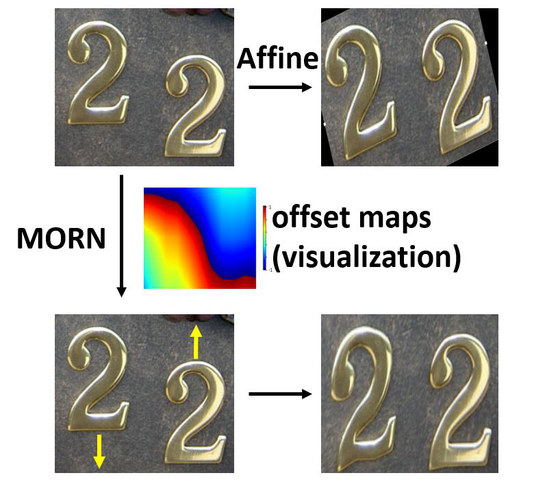

*Figure 3. Comparison of the MORN and affine transforma-tion. The MORN is free of geometric constraints. The main
direction of rectification predicted by the MORN for each
character is indicated by a yellow arrow. The offset maps
generated by the MORN are visualized as a heat map. The
offset values on the boundary between red and blue are zero.
The directions of rectification on both sides of the boundary
are opposite and outward. The depth of the color represents
the magnitude of the offset value. The gradual-change in
color indicates the smoothness of the rectification.*

transformation, it is limited to rotation, scaling, and translation.However, one image may have several kinds of deformations, and the distortion of scene text will thus be complicated.As shown in Fig. 3, the characters in the image become slanted after rectification by the affine transformation. The black edges introduce additional noise. Therefore, transfor-mations with geometric constraints can not cover all complicated deformations. Another method that is free of geometric con-straints, is the deformable convolutional network [9]. Using deformable convolutional kernels, the feature extractor automatically selects informative features. We attempted to combine the recognition network with a deformable convolutional network. However, as a sequence-to-sequence problem, irregular text recog-nition is more challenging. The network sometimes failed to converge. The best accuracy rate on IIIT5K we achieved was only 78.1%, which is far behind the state-of-the-art result (91.2%). Because the recognition models remain inade-quately strong to handle multiple disturbances from various shapes, we consider rectifying images to re-duce the difficulty of the recognition. As demonstrated in Fig. 4, the MORN architecture rectifies the distorted image. The MORN predicts the offset of each part of

the image without any geometric constraint.Based on the predicted offsets, the image is rectified and becomes easier to recognize. Furthermore, the MORN predicts the position off-sets but not the categories of characters. The character details for classification are not necessary. We hence place a pooling layer before the convolutional layer to avoid noise and reduce the amount of calculation.

*Table 1. Architecture of the MORN
TypeConfigurationsSize
Input-1×32×100
MaxPoolingk2, s21×16×50
Convolutionmaps:64, k3, s1, p164×16×50
MaxPoolingk2, s264×8×25
Convolutionmaps:128, k3, s1, p1128×8×25
MaxPoolingk2, s2128×4×12
Convolutionmaps:64, k3, s1, p164×4×12
Convolutionmaps:16, k3, s1, p116×4×12
Convolutionmaps:2, k3, s1, p12×4×12
MaxPoolingk2, s12×3×11
Tanh-2×3×11
Resize-2×32×100*

Here k, s, p are kernel, stride and padding sizes, respectively. For example, k3 represents a 3 × 3 kernel size.

The architecture of the MORN is given in Table1. Each convolutional layer is followed by a batch normalization layer and a ReLU layer except for the last one.The MORN first divides the image into several parts and then predicts the offset of each part.With an input size of 32 × 100, the MORN divides the image into 3 × 11 = 33 parts. All the offset values are activated by Tanh(·), resulting in values within the range of (−1, 1). The offset maps contain two channels, which denote the x-coordinate and y-coordinate respectively. Then, we apply bilinear interpolation to smoothly resize the offset maps to a size of 32 × 100, which is the same size of the input image.After allocating the specific offset to each pixel, the transformation of the image is smooth. As demonstrated in Fig.3, the color depth gradually changes on both sides of the boundary between the red and blue colors in the heat map, which evidences the smoothness of the rectification. There are no indented edges in the rectified image.

<!-- page:5 -->
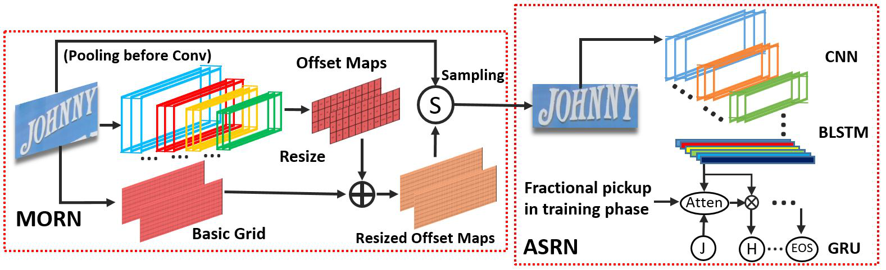

*Figure 4. Overall structure of MORAN.*

Moreover, because every value in the offset maps represents the offset from the original position, we generate a basic grid from the input image to represent the original positions of the pixels. The basic grid is generated by normalizing the coordinate of each pixel to [−1, 1]. The coordinates of the top-left pixel are (−1, −1), and those of the bottom-right one are (1, 1). Pixels at the same positions on different channels have the same coordinates. Similar to the offset maps, the grid contains two channels, which represent the x-coordinate and y-coordinate, respectively. Then, the basic grid and the resized offset maps are summed as follows,

offset^{′}_{(c,i,j)} = offset_{(c,i,j)} + basic_{(c,i,j)}, c = 1, 2 (1) where (i, j) is the position of the i-th row and j-th column. Before sampling, the x-coordinate and y-coordinate on the offset maps are normalized to [0, W] and [0, H], respectively. Here, H × W is the size of the input image. The pixel value of i-th row and j-th column in rectified image I^{′} is,

′ I(i,j) = I(i^{′},j^{′})(2)

�_{′} _{′} i= offset_{(1,i,j)}

_{′} _{′}(3) j= offset_{(2,i,j)}

′ where I is the input image. Further, iis obtained from ′ the first channel of the offset maps, whereas jis from ′ ′ the second channel. Both iand jare real values as opposed to integers so rectified image I^{′} is sampled from I using bilinear interpolation.

Because Equation (2) is differentiable, the MORN can back-propagate the gradients.The MORN can be trained in a weak supervision way with images and associated text labels only, which means that it does not need pixel-level labeling information about the deformation of the text. As Fig. 5 shows, the text in the input images is irregular. However, the text in the rectified images is more readable. Slanted or perspective texts become tightly bound after rectification. Furthermore, redun-dant noise is eliminated by the MORN for the curved texts.The background textures are removed in the rectified images of Fig. 5 (b). The advantages of the MORN are manifold.1) The rectified images are more readable owing to the regular shape of the text and the reduced noise. 2) The MORN is more flexible than the affine transformation. It is free of geometric constraints, which enables it to rectify images using complicated transformations. 3) The MORN is more flexible than methods using a specific number of regressing points. Existing method [42] cannot capture the text shape in details if the width of the image is large.Thus the MORN has no limit with respect to the image size, especially the width of the input image.4) The MORN does not require extra labelling information of character positions.Therefore, it can be trained in a weak supervision way by using existing training datasets.

### 3.2. Attention-based Sequence Recognition Net-work

As Fig. 4 shows, the major structure of the ASRN is a CNN-BLSTM framework.We adopt a one-

<!-- page:6 -->
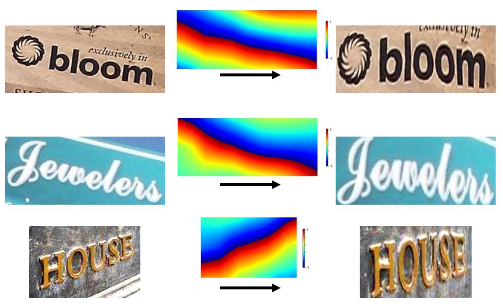

  1. (a) Perspective texts

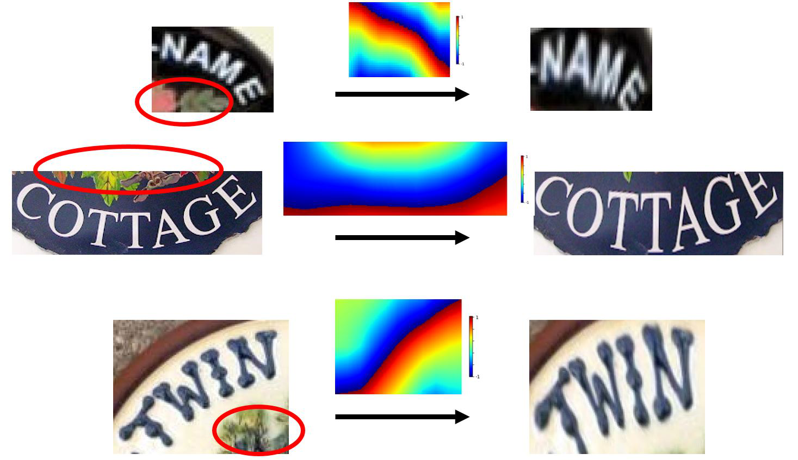

1. (b) curved texts
Figure 5. Results of the MORN on challenging image text.
The input images are shown on the left and the rectified
images are shown on the right. The heat maps visualize
offset maps as well as Fig. 3. (a) Slanted and perspective
text.(b) Curved text, which is more challenging for
recognition. Removed background textures are indicated
by red circles.

dimensional attention mechanism at the top of CRNN. The attention-based decoder, proposed by Bahdanau et al. [2], is used to accurately align the target and label. It is based on an RNN and directly generates the target sequence (y1, y2..., y_{N}). The largest number of steps that the decoder generates is T. The decoder stops processing when it predicts an end-of-sequence token “EOS” [47]. At time step t, output yt is,

yt = Softmax(Woutst + bout)(4)

where st is the hidden state at time step t. We update st using GRU [8]. State st is computed as:

st = GRU(yprev, gt, st−1)(5)

where yprev denotes the embedding vectors of the previous output yt−1 and gt represents the glimpse vectors, respectively calculated as,

yprev = Embedding(yt−1)(6)

*Table 2. Architecture of the ASRN
TypeConfigurationsSize
Input-1×32×100
Convolutionmaps:64, k3, s1, p164×32×100
MaxPoolingk2, s264×16×50
Convolutionmaps:128, k3, s1, p1128×16×50
MaxPoolingk2, s2128×8×25
Convolutionmaps:256, k3, s1, p1256×8×25
Convolutionmaps:256, k3, s1, p1256×8×25
MaxPoolingk2, s2x1, p0x1256×4×26
Convolutionmaps:512, k3, s1, p1512×4×26
Convolutionmaps:512, k3, s1, p1512×4×26
MaxPoolingk2, s2x1, p0x1512×2×27
Convolutionmaps:512, k2, s1512×1×26
BLSTMhidden unit:256256×1×26
BLSTMhidden unit:256256×1×26
GRUhidden unit:256256×1×26*

Here, k, s, p are kernel, stride and padding sizes, respectively. For example, s2 × 1 represents a 2 × 1 stride size. “BLSTM” stands for bidirectional-LSTM. “GRU” is in attention-based decoder.

�L

gt =

(αt,ihi)(7) i=1

where hi denotes the sequential feature vectors and L is the length of the feature maps. In addition, αt,i is the vector of attention weights as follows,

�^{L}

αt,i = exp(et,i)/

_{j=1}(exp(e_{t,j}))(8)

et,i = Tanh(Wsst−1 + Whhi + b)(9)

Here, Wout, bout, Ws, W_{h} and b are trainable parameters.Note that yprev is embedded from the ground truth of the last step in the training phase, whereas the ASRN only uses the predicted output of the last step as yt−1 in the testing phase. The decoder outputs the predicted word in an un-constrained manner in lexicon-free mode. If lexicons are available, we evaluate the probability distributions for all words and choose the word with the highest probability as the final result. The architecture of the ASRN is given in Table2. Each convolutional layer is followed by a batch normalization layer and a ReLU layer.

<!-- page:7 -->
Without FPWith FP

————————————————————-

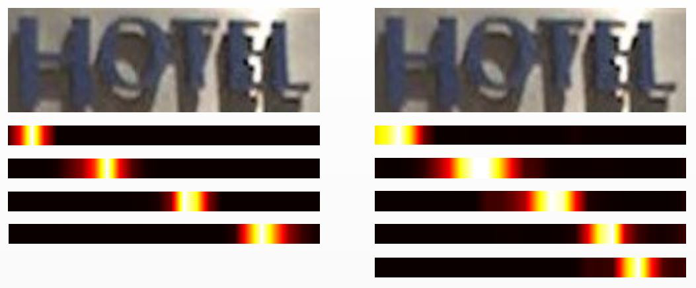

hotlhotel ————————————————————-

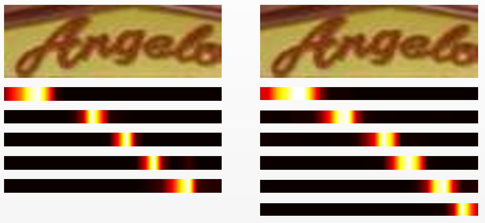

argehangels ————————————————————-

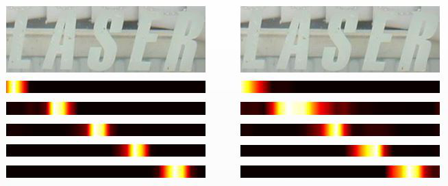

easerlaser ————————————————————-Figure 6. Difference in αt for training with and without fractional pickup. Here αt is visualized as a heat map. We delete the αt corresponding to “EOS”.

### 3.3. Fractional Pickup

The decoder in the ASRN learns the matching relationship between labels and target characters in images.It is a data-driven process.The ability to choose regions that are focus-worthy is enhanced by the feedback of correct alignment. However, scene text is surrounded by various types of noise. Often, the decoder is likely to be deceived into focusing on ambiguous background regions in practical applications.If the decoder generates an incorrect region of focus, the non-corresponding fea-tures are chosen, which can cause a failed prediction. Some challenging samples for recognition are pre-sented in Fig. 6. In this figure, the images contain text with shadows and unclear boundaries between characters or complicated backgrounds. Moreover, the focus regions generated by the decoder are narrow, which increases the probability of drifting from the correct regions.

We propose a training method called fractional pickup that fractionally picks up the neighboring features in the training phase.An attention-based decoder trained by fractional pickup method can perceive adjacent characters.The wider field of attention contributes to the robustness of the MORAN. We hence adopt fractional pickup at each time step of the decoder.In other words, a pair of attention weights are selected and modified at every time step. At time step t, α_{t,k} and α_{t,k+1} are updated as, �_{,} α_{t,k} = βαt,k + (1 −β)αt,k+1

_{,}(10) α_{t,k+1} = (1 −β)αt,k + βαt,k+1

where decimal β and integer k are randomly generated as, β = rand(0, 1)(11)

k = rand[1, T −1](12)

Here, T is the maximum number of steps of the decoder. Variation of Distribution Fractional pickup adds randomness to α_{t,k} and α_{t,k+1} in the decoder. This means that, even for the same image, the distribution of αt changes every time step in the training phase. As noted in Equation (7), the glimpse vectors gt grabs the sequential feature vectors hi according to the various distributions of αt, which is equivalent to the changes in feature areas. The randomness of β and k avoids over-fitting and contributes to the robustness of the decoder. Shortcut of Forward Propagation Sequential fea-ture vector hi is the output of the last bidirectional-LSTM in the ASRN. As shown in Fig.7, for step k + 1 in the bidirectional-LSTM, a shortcut connecting to step k is created by fractional pickup. The shortcut retains some features of the previous step in the training phase, which is the interference to the forget gate in bidirectional-LSTM. Therefore, fractional pickup provides more information about the previous step and increases the robustness for the bidirectional-LSTM in the ASRN. Broader Visual Field Training with fractional pickup disturbs the decoder through the local variation of αt,k and αt,k+1. Note that αt,k and αt,k+1 are neighbors. Without fractional pickup, the error term of sequence feature vector h_{k} is,

δh_{k} = δg_{t}αt,k(13)

<!-- page:8 -->
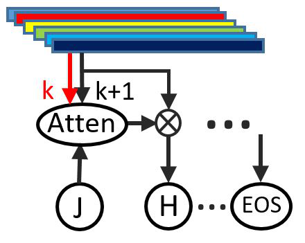

hi

*Figure 7. Fractional pickup creates a shortcut of forward
propagation. The shortcut is drawn as a red arrow.*

where δg_{t} is the error term of glimpse vector gt. δ_{hk} is only relevant to α_{t,k}. However, with fractional pickup, the error item becomes,

δh_{k} = δg_{t}(βαt,k + (1 −β)αt,k+1)(14)

where α_{t,k+1} is relevant to h_{k+1}, as noted in Equations (8) and (9), which means δ_{hk} is influenced by the neighbouring features.Owing to the disturbance, back-propagated gradients are able to dynamically optimize the decoder over a broader range of neigh-bouring regions. The MORAN trained with fractional pickup method generates a smoother αt at each time step.Ac-cordingly, it extracts features not only of the target characters, but also of the foreground and background context.As demonstrated in Fig.6, the expanded visual field enables the MORAN to correctly predict target characters. To the best of our knowledge, this is the first attempt to adopt a shortcut in the training of the attention mechanism.

### 3.4. Curriculum Training

The MORAN is end-to-end trainable with random initialization. However, end-to-end training consumes considerable time.We found that the MORN and ASRN can hinder each other during training.A MORN cannot be guided to rectify images when the input images have been correctly recognized by the high-performance ASRN. For the same reason, the ASRN will not gain robustness because the training samples have already been rectified by the MORN. The reasons above lead to inefficient training. Therefore, we propose a curriculum learning strat-egy to guide each sub-network in MORAN. The strategy is a three-step process.We first optimize the MORN and ASRN respectively and then join them together for further end-to-end training.The

difficulty of training samples is gradually increased. The training set is denoted as D = {Ii, Yi} , i = 1...N.We minimize the negative log-likelihood of conditional probability of D as follows:

|Y_{i}| �

�^{N}

Loss = −

_{t=1}log p(Yi,t | Ii; θ)(15)

i=1

where Yi,t is the ground truth of the t-th character in Ii. θ denotes the parameters of MORAN. First Stage for ASRN We first optimize the ASRN by using regular training samples. The dataset released by Gupta et al. [15] has tightly bounded annotations, which makes it possible to crop a text region with a tightly bounded box. The ASRN is first trained with these regular samples. Then, we simply crop every text using a minimum circumscribed horizontal rectangle to obtain irregular training samples. The commonly used datasets released by Jaderberg et al.[20] and Gupta et al.[15] offer abundant irregular training samples.We use them for the following training. Taking advantage of them, we optimize ASRN, which thus achieves higher accuracy. Second Stage for MORN The ASRN trained using regular training samples is chosen to guide the MORN training.This ASRN is not adequately robust for irregular text recognition so it is able to provide informative gradients for the MORN. We fix the parameters of this ASRN, and stack it after the MORN. If the transformation of the MORN does not reduce the difficulty of recognition, few meaningful gradients will be provided by the ASRN. The optimization of MORN would not progress.Only the correct transformation that decreases difficulty for recognition will give positive feedback to the MORN. Third Stage for End-to-end Optimization After the MORN and ASRN are optimized individually, we connect them for joint training in an end-to-end fashion. Joint training enables MORAN to complete end-to-end optimization and outperform state-of-the-art methods.

## 4. Experiments

In this section we describe extensive experiments conducted on various benchmarks, including regular and irregular datasets.The performances of all the methods are measured by word accuracy.

<!-- page:9 -->
*Table 3. Comparison of pooling layers in lexicon-free mode. “No”, “AP” and “MP” respectively indicate no pooling layer,
an average-pooling layer and a max-pooling layer at the top of the MORN. The kernel size is 2. “s” represents the stride.*

sIIIT5KSVTIC03IC13SVT-PCUTE80IC15 No-85.787.992.991.575.865.959.4 AP289.287.494.891.175.971.164.6 AP189.387.994.791.675.972.964.9 MP290.488.294.591.876.176.468.4 MP191.288.395.092.476.177.468.8

*Table 4. Performance of the MORAN.
MethodIIIT5KSVTIC03IC13SVT-PCUTE80IC15
End-to-end training89.984.192.590.076.177.168.8
Only ASRN84.282.291.090.171.064.665.6
MORAN without FP89.787.394.591.575.577.168.6
MORAN with FP91.288.395.092.476.177.468.8*

### 4.1. Datasets

IIIT5K-Words(IIIT5K)[32]contains3000 cropped word images for testing.Every image has a 50-word lexicon and a 1000-word lexicon.The lexicon consists of a ground truth and some randomly picked words. Street View Text (SVT) [48] was collected from the Google Street View, consisting of 647 word images. Many images are severely corrupted by noise and blur, or have very low resolutions. Each image is associated with a 50-word lexicon. ICDAR 2003 (IC03) [31] contains 251 scene im-ages that are labeled with text bounding boxes. For fair comparison, we discarded images that contain non-alphanumeric characters or those have less than three characters, following Wang, Babenko, and Belongie [48]. The filtered dataset contains 867 cropped images. Lexicons comprise of a 50-word lexicon defined by Wang et al. [48] and a “full lexicon”. The latter lexicon combines all lexicon words. ICDAR 2013 (IC13) [25] inherits most of its samples from IC03. It contains 1015 cropped text images. No lexicon is associated with this dataset. SVT-Perspective(SVT-P)[35]contains645 cropped images for testing. Images are selected from side-view angle snapshots in Google Street View. Therefore, most images are perspective distorted. Each image is associated with a 50-word lexicon and a full lexicon. CUTE80 [37] contains 80 high-resolution images taken in natural scenes. It was specifically collected

for evaluating the performance of curved text recog-nition.It contains 288 cropped natural images for testing. No lexicon is associated with this dataset. ICDAR 2015 (IC15) [24] contains 2077 cropped images including more than 200 irregular text.No lexicon is associated with this dataset.

### 4.2. Implementation Details

Network: Details about the MORN and the ASRN of MORAN are given in Table1 and Table2 respec-tively.The number of hidden units of GRU in the decoder is 256. The ASRN outputs 37 classes, including 26 letters, 10 digits and a symbol standing for “EOS”. Training Model:As stated in Section 3.4, the training of the MORAN is guided by a curriculum learning strategy.The training data consists of 8-million synthetic images released by Jaderberg et al. [20] and 6-million synthetic images released by Gupta et al.[15].No extra data is used.We do not use any geometric-level or pixel-level labels in our experiments. Without any fine-tuning for each specific dataset, the model is trained using only synthetic text. With ADADELTA [55] optimization method, we set learning rate to 1.0 at the beginning and decreased it to 0.01 in the third stage of the curriculum learning strategy.Following the similar settings in [28], we found that a decreased learning rate contributes to better convergence. The batch size was set to 64. We trained the model for 600,000, 20,000 and 300,000 iterations respectively in three stages of the curriculum

<!-- page:10 -->
learning strategy. The training totally consumed 30 hours. Implementation:We implemented our method under the framework of PyTorch [34].CUDA 8.0 and CuDNN v7 backends are used in our experiments so our model is GPU-accelerated.All the images are resized to 32 × 100. With an NVIDIA GTX-1080 Ti GPU, the MORAN takes 10.4ms to recognize an image containing fvie characters in lexicon-free mode.

4.3. Performance of the MORAN

We used a max-pooling layer at the top of the MORN. To evaluate the effectiveness of this tech-nique, a comparison of pooling layers with different configurations is shown in Table 3. The accuracy is the highest when we use a max-pooling layer with a kernel size of 2 and stride of 1. Before conducting a comparison with other meth-ods, we list three results with a progressive com-bination of methods in Table 4. The MORAN trained in an end-to-end manner already achieves very promising performance. In curriculum learning, the first experiment is carried out using only an ASRN. Then, a MORN is added to the bottom of the above network to rectify the images.The last result is from the entire MORAN, including the MORN and ASRN trained with the fractional pickup method. The contribution of each part of our method is hence clearly demonstrated.For ICDAR OCR tasks, we report the total edit distance in Table 5.

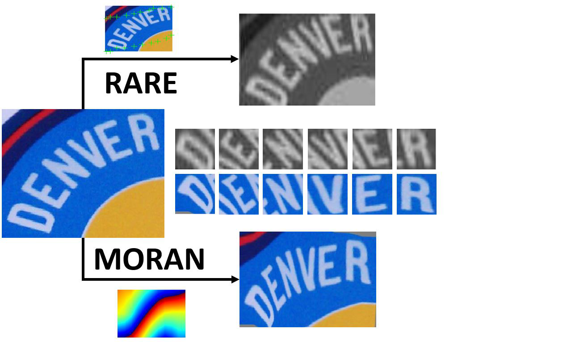

*Table 5. Performance of the MORAN (total edit distance).*

MethodIC03IC13IC15 End-to-end training29.157.7368.8 Only ASRN33.869.1376.8 MORAN without FP22.745.3345.2 MORAN with FP19.842.0334.0

### 4.4. Comparisons with Rectification Methods

Affine Transformation:The results using the affine transformation are provided by Liu et al. [28]. For fair comparison, we replace the ASRN by the R-Net proposed by Liu et al. [28]. A direct comparison of the results is shown in Table 6. As demonstrated in Fig.3 and described in Section 3.1, affine transforma-tion is limited by the geometric constraints of rotation,

scaling and translation.However, the distortion of scene text is complicated.The MORAN is more flexible than affine transformation. It is able to predict smooth rectification for images free of geometric constraints.

*Table 6. Comparison with STAR-Net.
MethodIIIT5K SVTIC03 IC13 SVT-P
Liu et al. [28]83.383.689.989.173.5
Ours87.583.992.589.174.6*

RARE [42]: The results of RARE given by Shi et al.[42] are in the Table 8 and Table 9. We directly compare the network using exactly the same recognition network as that proposed in RARE. The results are shown in Table 7. The MORAN has some benefits and drawbacks comparing with RARE. RARE using fiducial points can only capture the overall text shape of an input im-age, whereas the MORAN can rectify every character in an image. As shown in Fig. 8, all the characters in the image rectified by the MORAN are more normal in appearance than those of RARE. Furthermore, the MORAN without any fiducial points is theoretically able to rectify text of infinite length.

Predict:stinker

GT:denver

Predict:denver

*Figure 8. Comparison of the MORAN and RARE. All char-acters are cropped for further comparison. The recognition
results are on the right. “GT” denotes the ground truth.*

The training of MORAN is more difficult than that of RARE. We thus designed a curriculum learning strategy to enable the stable convergence of the MORAN. In terms of RARE, although it is end-to-end optimized with special initialization, randomly initial-ized network may result in failure of convergence.

<!-- page:11 -->
*Table 7. Comparison with RARE.
MethodIIIT5KSVTIC03IC13SVT-PCUTE80
Shi et al. [42]81.981.990.188.671.859.2
Ours87.983.992.790.073.272.6*

*Table 8. Results on general benchmarks. “50” and “1k” are lexicon sizes. “Full” indicates the combined lexicon of all images
in the benchmarks. “None” means lexicon-free.*

IIIT5KSVTIC03IC13 Method 501kNone50 None50 FullNoneNone Almaza´n et al [1]91.282.1-89.2-----Yao et al. [52]80.269.3-75.9-88.580.3--R.-Serrano et al. [38]76.157.4-70.0-----Jaderberg et al. [23]---86.1-96.291.5--Su and Lu [44]---83.0-92.082.0--Gordo [12]93.386.6-91.8-----Jaderberg et al. [21]95.589.6-93.271.797.897.089.681.8 Jaderberg et al. [22]97.192.7-95.480.7*98.798.693.1*90.8* Shi, Bai, and Yao [41]97.895.081.297.582.798.798.091.989.6 Shi et al. [42]96.293.881.995.581.998.396.290.188.6 Lee and Osindero [27]96.894.478.496.380.797.997.088.790.0 Liu et al. [28]97.794.583.395.583.696.995.389.989.1 Yang et al. [51]97.896.1-95.2-97.7---Yin et al. [54]98.796.178.295.172.597.696.581.181.4 Cheng et al. [5]98.996.883.795.782.298.596.791.589.4 Cheng et al. [6]99.698.187.096.082.898.597.191.5-Ours97.996.291.296.688.398.797.895.092.4

### 4.5. Results on General Benchmarks

The MORAN was evaluated on general benchmarks in which most of the testing samples are regular text and a small part of them are irregular text.The MORAN was compared with 16 methods and the results are shown in Table 8. In Table 8, the MORAN outperforms all current state-of-the-art methods in lexicon-free mode.As Jaderberg [22] treated each word as a category and the model cannot predict out-of-vocabulary words, we highlight these results by adding an asterisk.FAN [5] trained with pixel-level supervision is also beyond the scope of consideration.We hence compare the MORAN with the baseline of FAN.

### 4.6. Results on Irregular Text

The MORAN was also evaluated on irregular text datasets to reveal the contribution of the MORN. The results on SVT-Perspective, CUTE80 and IC15 are shown in Table 9. The MORAN is still the best of

all methods. For the SVT-Perspective dataset, many samples are low-resolution and perspective.The result of the MORAN with 50-word lexicon is the same as that of the method of Liu et al. [28]. However, the MORAN outperforms all methods in the setting without any lexicon. In addition to perspective text, the MORAN is able to recognize curved text.Some examples are demonstrated in Fig. 9. The MORAN is able to rectify most curved text in CUTE80 and correctly recognize them. It is hence adequately robust to rectify text with small curve angle.

4.7. Limitation of the MORAN

For fair comparisons and good repeatability, we chose the widely used training datasets, which contain only horizontal synthetic text. Therefore, because of complicated background, the MORAN will fail when the curve angle is too large. Such cases are given in the

<!-- page:12 -->
*Table 9. Results on irregular datasets. “50” is lexicon sizes. “Full” indicates the combined lexicon of all images in the
benchmarks. “None” means lexicon-free.*

SVT-PerspectiveCUTE80IC15 Method 50 FullNoneNoneNone ABBYY et al. [48]40.526.1---Mishra et al. [32]45.724.7---Wang et al. [50]40.232.4---Phan et al. [35]75.667.0---Shi et al. [42]91.277.471.859.2-Yang et al. [51]93.080.275.869.3-Liu et al. [28]94.383.673.5--Cheng et al. [5]92.681.671.563.966.2 Cheng et al. [6]94.083.773.076.868.2 Ours94.386.776.177.468.8

Input ImageRectified Images Ground Truth Prediction —————————————————————– west west

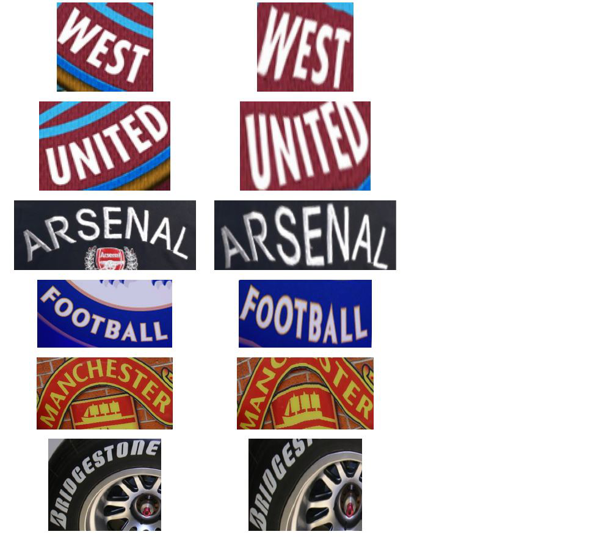

————— united

united ————— arsenal arsenal ————— football football ————— manchester messageid ————— briogestone contracers —————————————————————– Figure 9. Effects of different curve angles of scene text. The first four rows are text with small curve angles and the last two rows are text with large curve angles. The MORAN can rectify irregular text with small curve angles.

last two rows of Fig. 9. MORAN mistakenly regards the complicated background as foreground. However, such samples are rare in training datasets. Furthermore, with the existing training datasets and without any data augmentation, the MORAN focuses more on horizontal irregular text. Note that there are many vertical text in IC15. However, the MORAN is not designed for vertical text.Our method was

proposed for the complicated deformation of text within a cropped horizontal rectangle. The experiments above are all based on cropped text recognition. A MORAN without a text detector is not an end-to-end scene text recognition system. Actually, in more application scenarios, irregular and multi-oriented text are challenging both for detection and recognition, which have attracted great interest. For instance, Liu et al. [29] and Ch’ng et al. [7] released complicated datasets. Sain et al. [39] and He et al. [18] proposed methods to improve the performance of multi-oriented text detection.Therefore, scene text recognition still remains a challenging problem waiting for solutions.

## 5. Conclusion

In this paper, we presented a multi-object rec-tified attention network (MORAN) for scene text recognition.The proposed framework involves two stages: rectification and recognition. First, a multi-object rectification network, which is free of geometric constraints and flexible enough to handle compli-cated deformations, was proposed to transform an image containing irregular text into a more readable one.The rectified patterns decrease the difficulty of recognition.Then, an attention-based sequence recognition network was designed to recognize the rectified image and outputs the characters in sequence. Moreover, a fractional pickup method was proposed to expand the visual field of the attention-based decoder.The attention-based decoder thus obtains more context information and gains robustness.To

<!-- page:13 -->
efficiently train the network, we designed a curriculum learning strategy to respectively strengthen each sub-network.The proposed MORAN is trained in a weak-supervised way, which requires only images and the corresponding text labels.Experiments on both regular and irregular datasets, including IIIT5K, SVT, ICDAR2003, ICDAR2013, ICDAR2015, SVT-Perspective and CUTE80, demonstrate the outstanding performance of the MORAN. In future, it is worth extending this method to deal with arbitrary-oriented text recognition, which is more challenging due to the wide variety of text and background. Moreover, the improvements in end-to-end text recognition performance come not just from the recognition model, but also from detection model. Therefore, finding a proper and effective way to combine the MORAN with a scene text detector is also a direction worth of study.

Acknowledgement

This research was supported by the National KeyR&DProgramofChina(GrantNo.: 2016YFB1001405),GD-NSF(GrantNo.: 2017A030312006), NSFC (Grant No.:61472144, 61673182), GDSTP (Grant No.: 2015B010101004, 2015B010130003, 2017A030312006), GZSTP (Grant No.: 201607010227).

References

[1] J. Almaza´n, A. Gordo, A. Forne´s, and E. Valveny. Word spotting and recognition with embedded at-tributes.IEEE Trans. Pattern Anal. Mach. Intell., 36(12):2552–2566, 2014. [2] D. Bahdanau, K. Cho, and Y. Bengio. Neural machine translation by jointly learning to align and translate. CoRR, abs/1409.0473 (2014). [3] A. Bissacco, M. Cummins, Y. Netzer, and H. Neven. Photoocr: Reading text in uncontrolled conditions. In Proceedings of International Conference on Com-puter Vision (ICCV), pages 785–792, 2013. [4] F. L. Bookstein. Principal warps: Thin-plate splines and the decomposition of deformations. IEEE Trans. Pattern Anal. Mach. Intell., 11(6):567–585, 1989. [5] Z. Cheng, F. Bai, Y. Xu, G. Zheng, S. Pu, and S. Zhou. Focusing attention: Towards accurate text recognition in natural images.In Proceedings of International Conference on Computer Vision (ICCV), pages 5086– 5094, 2017.

[6] Z. Cheng, Y. Xu, F. Bai, Y. Niu, S. Pu, and S. Zhou. AON: Towards arbitrarily-oriented text recognition. In Proceedings of the IEEE Conference on Computer Vision and Pattern Recognition (CVPR), pages 5571– 5579, 2018. [7] C. K. Ch’ng and C. S. Chan. Total-text: A compre-hensive dataset for scene text detection and recogni-tion. In Proceedings of International Conference on Document Analysis and Recognition (ICDAR), pages 935–942, 2017. [8] K. Cho, B. van Merrienboer, C¸ . Gu¨lc¸ehre, D. Bah-danau, F. Bougares, H. Schwenk, and Y. Bengio. Learning phrase representations using RNN encoder-decoder for statistical machine translation.In Proceedings of the 2014 Conference on Empirical Methods in Natural Language Processing, (EMNLP), pages 1724–1734, 2014. [9] J. Dai, H. Qi, Y. Xiong, Y. Li, G. Zhang, H. Hu, and Y. Wei. Deformable convolutional networks. In Pro-ceedings of International Conference on Computer Vision (ICCV), pages 764–773, 2017. [10] N. Dalal and B. Triggs.Histograms of oriented gradients for human detection.In Proceedings of Computer Vision and Pattern Recognition (CVPR), pages 886–893, 2005. [11] L. Go´mez and D. Karatzas.Textproposals: a text-specific selective search algorithm for word spotting in the wild. Pattern Recognit., 70:60–74, 2017. [12] A. Gordo.Supervised mid-level features for word image representation.In Proceedings of Computer Vision and Pattern Recognition (CVPR), pages 2956– 2964, 2015. [13] A. Graves, S. Ferna´ndez, F. Gomez, and J. Schmidhu-ber. Connectionist temporal classification: labelling unsegmented sequence data with recurrent neural networks. In Proceedings of International Conference on Machine Learning (ICML), pages 369–376, 2006. [14] J. Gu, Z. Wang, J. Kuen, L. Ma, A. Shahroudy, B. Shuai, T. Liu, X. Wang, G. Wang, J. Cai, et al. Recent advances in convolutional neural networks. Pattern Recognit., 77:354–377, 2018. [15] A. Gupta, A. Vedaldi, and A. Zisserman. Synthetic data for text localisation in natural images. In Pro-ceedings of Computer Vision and Pattern Recognition (CVPR), pages 2315–2324, 2016. [16] K. He, X. Zhang, S. Ren, and J. Sun. Deep residual learning for image recognition.In Proceedings of Computer Vision and Pattern Recognition (CVPR), pages 770–778, 2016. [17] P. He, W. Huang, Y. Qiao, C. C. Loy, and X. Tang. Reading scene text in deep convolutional sequences. In Proceedings of Association for the Advancement

<!-- page:14 -->
of Artificial Intelligence (AAAI), pages 3501–3508, 2016. [18] W. He, X.-Y. Zhang, F. Yin, and C.-L. Liu. Multi-oriented and multi-lingual scene text detection with direct regression.IEEE Trans. Image Processing, 27(11):5406–5419, 2018. [19] S. Hochreiter and J. Schmidhuber. Long short-term memory. Neural computation, 9(8):1735–1780, 1997. [20] M. Jaderberg, K. Simonyan, A. Vedaldi, and A. Zis-serman. Synthetic data and artificial neural networks for natural scene text recognition.In Proceedings of Advances in Neural Information Processing Deep Learn. Workshop (NIPS-W), 2014. [21] M. Jaderberg, K. Simonyan, A. Vedaldi, and A. Zis-serman.Deep structured output learning for un-constrained text recognition.In Proceedings of In-ternational Conference on Learning Representations (ICLR), 2015. [22] M. Jaderberg, K. Simonyan, A. Vedaldi, and A. Zis-serman. Reading text in the wild with convolutional neural networks. International Journal of Computer Vision, 116(1):1–20, 2016. [23] M. Jaderberg, A. Vedaldi, and A. Zisserman. Deep features for text spotting. In Proceedings of European Conference on Computer Vision (ECCV), pages 512– 528, 2014. [24] D.Karatzas,L.Gomez-Bigorda,A.Nicolaou, S. Ghosh, A. Bagdanov, M. Iwamura, J. Matas, L. Neumann, V. R. Chandrasekhar, S. Lu, et al. ICDAR 2015 competition on robust reading.In Proceedings of International Conference on Docu-ment Analysis and Recognition (ICDAR), pages 1156– 1160, 2015. [25] D. Karatzas, F. Shafait, S. Uchida, M. Iwamura, L. G. i Bigorda, S. R. Mestre, J. Mas, D. F. Mota, J. A. Almazan, and L. P. De Las Heras. ICDAR 2013 robust reading competition. In Proceedings of International Conference on Document Analysis and Recognition (ICDAR), pages 1484–1493, 2013. [26] V. Khare, P. Shivakumara, P. Raveendran, and M. Blu-menstein. A blind deconvolution model for scene text detection and recognition in video. Pattern Recognit., 54:128–148, 2016. [27] C.-Y. Lee and S. Osindero. Recursive recurrent nets with attention modeling for OCR in the wild. In Pro-ceedings of Computer Vision and Pattern Recognition (CVPR), pages 2231–2239, 2016. [28] W. Liu, C. Chen, K.-Y. K. Wong, Z. Su, and J. Han. STAR-Net: A spatial attention residue network for scene text recognition.In Proceedings of British Machine Vision Conference (BMVC), page 7, 2016.

[29] Y. Liu, L. Jin, S. Zhang, and S. Zhang. Detecting curve text in the wild: New dataset and new solution. CoRR, abs/1712.02170 (2017), 2017. [30] X. Lou, K. Kansky, W. Lehrach, C. Laan, B. Marthi, D. Phoenix, and D. George. Generative shape models: Joint text recognition and segmentation with very little training data. In Proceedings of Advances in Neural Information Processing Systems (NIPS), pages 2793– 2801, 2016. [31] S. M. Lucas, A. Panaretos, L. Sosa, A. Tang, S. Wong, and R. Young. ICDAR 2003 robust reading competi-tions. In Proceedings of International Conference on Document Analysis and Recognition (ICDAR), pages 682–687, 2003. [32] A. Mishra, K. Alahari, and C. Jawahar. Scene text recognition using higher order language priors.In Proceedings of British Machine Vision Conference (BMVC), pages 1–11, 2012. [33] L. Neumann and J. Matas.Real-time scene text localization and recognition.In Proceedings of Computer Vision and Pattern Recognition (CVPR), pages 3538–3545, 2012. [34] A. Paszke, S. Gross, S. Chintala, G. Chanan, E. Yang, Z. DeVito, Z. Lin, A. Desmaison, L. Antiga, and A. Lerer.Automatic differentiation in pytorch.In Proceedings of Advances in Neural Information Pro-cessing Systems Autodiff Workshop (NIPS-W), 2017. [35] T. Quy Phan, P. Shivakumara, S. Tian, and C. Lim Tan. Recognizing text with perspective distortion in natural scenes. In Proceedings of International Conference on Computer Vision (ICCV), pages 569–576, 2013. [36] J. Rabin, G. Peyre´, J. Delon, and M. Bernot. Wasser-stein barycenter and its application to texture mixing. In Proceedings of International Conference on Scale Space and Variational Methods (ICSSVM), pages 435–446, 2011. [37] A. Risnumawan, P. Shivakumara, C. S. Chan, and C. L. Tan. A robust arbitrary text detection system for natural scene images.Expert Systems with Applications, 41(18):8027–8048, 2014. [38] J. A. Rodriguez-Serrano, A. Gordo, and F. Perronnin. Label embedding: A frugal baseline for text recog-nition.International Journal of Computer Vision, 113(3):193–207, 2015. [39] A. Sain, A. K. Bhunia, P. P. Roy, and U. Pal. Multi-oriented text detection and verification in video frames and scene images. Neurocomputing, 275:1531–1549, 2018. [40] J.-H. Seok and J. H. Kim.Scene text recognition using a hough forest implicit shape model and semi-markov conditional random fields. Pattern Recognit., 48(11):3584–3599, 2015.

<!-- page:15 -->
[41] B. Shi, X. Bai, and C. Yao. An end-to-end trainable neural network for image-based sequence recognition and its application to scene text recognition.IEEE Trans. Pattern Anal. Mach. Intell., 39(11):2298–2304, 2017.

[42] B. Shi, X. Wang, P. Lyu, C. Yao, and X. Bai. Robust scene text recognition with automatic rectification. In Proceedings of Computer Vision and Pattern Recog-nition (CVPR), pages 4168–4176, 2016.

[43] C. Shi, C. Wang, B. Xiao, S. Gao, and J. Hu. End-to-end scene text recognition using tree-structured models. Pattern Recognit., 47(9):2853–2866, 2014.

[44] B. Su and S. Lu. Accurate scene text recognition based on recurrent neural network. In Proceedings of Asian Conference on Computer Vision (ACCV), pages 35– 48, 2014.

[45] B. Su and S. Lu. Accurate recognition of words in scenes without character segmentation using recurrent neural network. Pattern Recognit., 63:397–405, 2017.

[46] L. Sun, Q. Huo, W. Jia, and K. Chen.A robust approach for text detection from natural scene images. Pattern Recognit., 48(9):2906–2920, 2015.

[47] I. Sutskever, O. Vinyals, and Q. V. Le. Sequence to sequence learning with neural networks. In Proceed-ings of Advances in Neural Information Processing Systems (NIPS), pages 3104–3112, 2014.

[48] K. Wang, B. Babenko, and S. Belongie.End-to-end scene text recognition.In Proceedings of International Conference on Computer Vision (ICCV), pages 1457–1464, 2011.

[49] K. Wang and S. Belongie. Word spotting in the wild. In Proceedings of European Conference on Computer Vision (ECCV), pages 591–604, 2010.

[50] T. Wang, D. J. Wu, A. Coates, and A. Y. Ng. End-to-end text recognition with convolutional neural networks. In Proceedings of International Conference on Pattern Recognition (ICPR), pages 3304–3308, 2012.

[51] X. Yang, D. He, Z. Zhou, D. Kifer, and C. L. Giles. Learning to read irregular text with attention mechanisms.In Proceedings of International Joint Conference on Artificial Intelligence, (IJCAI), pages 3280–3286, 2017.

[52] C. Yao, X. Bai, B. Shi, and W. Liu.Strokelets: A learned multi-scale representation for scene text recognition. In Proceedings of Computer Vision and Pattern Recognition (CVPR), pages 4042–4049, 2014.

[53] Q. Ye and D. Doermann. Text detection and recogni-tion in imagery: A survey. IEEE Trans. Pattern Anal. Mach. Intell., 37(7):1480–1500, 2015.

[54] F. Yin, Y. Wu, X. Zhang, and C. Liu.Scene text recognition with sliding convolutional character models. CoRR, abs/1709.01727 (2017), 2017. [55] M. D. Zeiler. ADADELTA: an adaptive learning rate method. CoRR, abs/1212.5701 (2012), 2012. [56] A. Zhu, R. Gao, and S. Uchida. Could scene context be beneficial for scene text detection?Pattern Recognit., 58:204–215, 2016. [57] Y. Zhu, C. Yao, and X. Bai.Scene text detection and recognition: Recent advances and future trends. Frontiers of Computer Science, 10(1):19–36, 2016.

