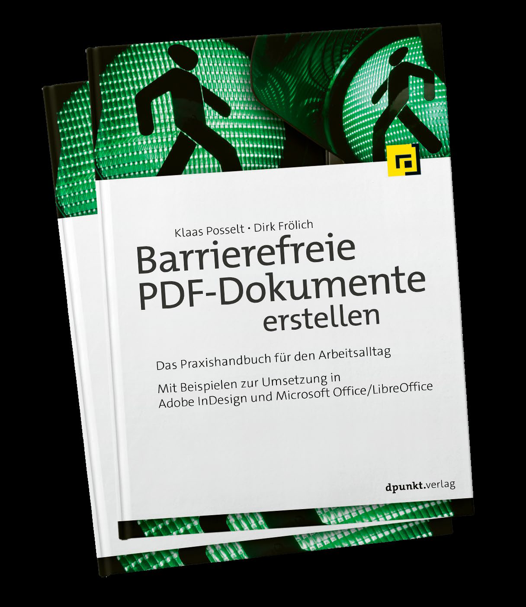

<!-- page:1 -->
www.pdfa.org

# DocEng 2019: More than just digital paper – hidden features of the PDF format

# Tagged PDF

# PDF Association Tutorial:
More than just digital paper –
hidden features of the PDF format

# Klaas Posselt

Klaas Posselt, Member of the PDF Association

<!-- page:2 -->
# Topics

## 1. Short intro on accessibility and Tagged PDF

## 2. Advantages of Tagged PDF

## 3. Future of Tagged PDF

## 4. How to get Tagged / accessible PDF?

<!-- page:3 -->
# Short intro on accessibility and Tagged PDF^{*}

# ■ EQUAL access for ALL people

# ■ Forced by law and promoted by guidelines

# (Sect 508 [US], BITV [GER], WCAG [W3C], PDF/UA [ISO])

# ■ PDF-Tags (like in HTML) grant access

# Example

- * More info: PDF/UA in a Nutshell, https://www.pdfa.org/resource/pdfua-in-a-nutshell/

<!-- page:4 -->
# Main rules:

# ■ All elements must be tagged, semantically appropriate

# ■ The logical reading order (order of tags) must be defined

# ■ All non text elements need text alternatives (description)

# More rules, e.g.:

# ■ All glyphs Unicode (€ ✓ ≠)

# ■ Document title defined and shown

<!-- page:5 -->
# Advantages of Tagged PDF

# ■ Law conformance

# ■ In result for free:

# Reuse of content (as Word, HTML; EPUB, …)

# Example

<!-- page:6 -->
# Future of Tagged PDF

# ■ PDF 2.0 changed much (e.g. new tags)

# ■ Enhanced possibilities (Derivation algorithm^{*})

# Example

- * Deriving HTML from PDF: an algorithm, https://www.pdfa.org/deriving-html-from-pdf-an-algorithm/

<!-- page:7 -->
# How to get Tagged / accessible PDF?

# ■ Use the right tools

# ■ Basic knowledge for all participants (see pdfa.org^{*})

# ■ I recommend: Don´t tag a PDF afetr it is generated

- * E.g. Tagged PDF Best Practice Guide: Syntax, https://www.pdfa.org/resource/tagged-pdf-best-practice-guide-syntax/

<!-- page:8 -->
# Thank you!
 Any questions?

# Get in touch
klaas.posselt@einmanncombo.de
www.einmanncombo.de
@einmanncombo
linkedin.com/in/einmanncombo

