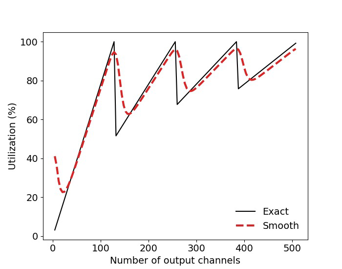
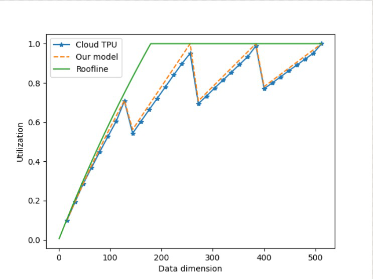

<!-- page:1 -->
# U-Boost NAS: Utilization-Boosted Differentiable
Neural Architecture Search

Ahmet Caner Yu¨zu¨gu¨ler, Nikolaos Dimitriadis, and Pascal Frossard

EPFL
{ahmet.yuzuguler,nikolaos.dimitriadis,pascal.frossard}@epfl.ch

## Abstract

. Optimizing resource utilization in target platforms is key to achieving high performance during DNN inference. While optimizations have been proposed for inference latency, memory footprint, and energy consumption, prior hardware-aware neural architecture search (NAS) methods have omitted resource utilization, preventing DNNs to take full advantage of the target inference platforms. Modeling resource utiliza-tion efficiently and accurately is challenging, especially for widely-used array-based inference accelerators such as Google TPU. In this work, we propose a novel hardware-aware NAS framework that does not only optimize for task accuracy and inference latency, but also for resource utilization. We also propose and validate a new computational model for resource utilization in inference accelerators. By using the proposed NAS framework and the proposed resource utilization model, we achieve 2.8 −4× speedup for DNN inference compared to prior hardware-aware NAS methods while attaining similar or improved accuracy in image classification on CIFAR-10 and Imagenet-100 datasets.^{1}

Keywords: Hardware-aware neural architecture search, DNN inference,
hardware accelerator, resource utilization

## 1 Introduction

Deep neural networks (DNN) have drastically evolved in recent years to push the limits in numerous computer vision tasks such as image recognition, object detection, and semantic segmentation [14, 20]. To reach state-of-the-art perfor-mance, today’s DNN models contain hundreds of layers to boost their perfor-mance. However, this comes at the expense of high computational complexity, which often leads to long inference latency in resource-constraint settings (e.g., mobile devices) [31, 34]. It therefore becomes important to co-optimize model accuracy with inference runtime metrics, which is an important area of research in the design of effective DNN architectures [34]. The effective usage of hardware resources (i.e., hardware utilization) in tar-get inference platforms may vary depending on the architecture of a DNN model (e.g., layer types or channel dimensions). For instance, the depthwise convolu-tion operation, which is popularly used in DNNs, has been shown to reduce

^{1} Source code is available at https://github.com/yuezuegu/UBoostNAS

<!-- page:2 -->
2A. C. Yu¨zu¨gu¨ler et. al

the hardware utilization down to 1% in inference platforms [13]. Likewise, the channel and filter dimensions of DNN layers also have a significant impact on hardware utilization due to mismatches between DNN dimensions and target inference platforms [9, 30]. As a result, unoptimized DNN models unfortunately run on inference platforms with low hardware utilization, hindering their perfor-mance (FLOPS/s) and increasing the latency. For example, average FLOPS/s utilization in Google’s TPUv4 accelerator is 33% [17], which results in about three times slower inference than what could be achieved with a fully-utilized platform. Prior works have proposed hardware-aware neural architecture search meth-ods to co-optimize model accuracy and hardware performance metrics [32]. These methods use latency [34, 35, 37], energy consumption [41], or memory footprint [26] as the hardware performance metrics, which allows to improve the com-putational efficiency of the DNN architectures. However, no prior work uses hardware utilization as an optimization objective, which leads to DNN models with low efficiency in inference platforms. Moreover, prior hardware-aware NAS methods rely on either ”black-box” hardware models, where these metrics are measured in physical devices and stored in look-up tables, or simplistic models such as roofline [13, 23] to estimate the hardware performance metrics of the target inference platforms. Unfortunately, these models are impractical, have limited precision, or are non-differentiable, which hinders their effective use in NAS methods. While prior hardware-aware NAS frameworks mostly focus on inference la-tency (i.e., execution time in terms of seconds), we argue that this does not necessarily lead to effective usage of hardware resources (i.e., percentage of pro-cessing elements actively used during computation) at the inference platforms. Therefore, we propose a NAS method that co-optimizes hardware utilization along with model accuracy and latency. To do so, we develop a hardware utiliza-tion model for inference platforms and use it to estimate the hardware utilization while searching for the optimal DNN architecture in image classification tasks. Moreover, we provide a smooth relaxation for the proposed utilization model to allow differentiable NAS, which is orders of magnitude less costly than other NAS methods. To the best of our knowledge, this is the first work that ad-dresses hardware utilization in DNN inference using neural architecture search. We demonstrate through extensive experiments and hardware simulations that DNN models produced by our proposed NAS method run 2.8 −4× faster in tar-get inference platforms compared to prior hardware-aware NAS methods that are agnostic to resource utilization. In this paper, we make the following contributions:

– We show that hardware utilization in DNN inference is sensitive to layer types and dimensions of the architecture, and that fine-tuning a DNN ar-chitecture may significantly improve hardware utilization while maintaining the model accuracy. – We propose a computational model for hardware utilization in modern in-ference platforms that estimates the measured utilization with signifciantly

<!-- page:3 -->
U-Boost NAS: Utilization-Boosted Differentiable Neural Architecture Search3

higher accuracy compared to prior models. We also provide a smooth relax-ation of the proposed computational model to enable gradient-based opti-mization. – We propose a differential neural architecture search framework that does not only optimize for task accuracy and inference latency, but also resource utilization at target inference platforms. – We perform image classification experiments on the CIFAR-10 and Imagenet-100 datasets as well as detailed hardware simulations to show that the pro-posed utilization-aware NAS method signifciantly improves the hardware utilization and inference latency on typical computer vision tasks.

## 2 Related Work

Neural architecture search methods aim to automate the design process for DNN architectures that can achieve high accuracy on the given machine learning tasks with low latency and improved efficiency in target inference platforms. In fact, recent work has shown that DNNs produced with hardware-aware NAS meth-ods outperform the hand-crafted DNNs in terms of accuracy and latency [34]. However, NAS methods require vast amounts of computational power, which motivates researchers to study more efficient methods. Early versions of NAS methods used reinforcement learning [28, 34, 44, 45], evolutionary algorithms [26, 29], and Bayesian optimization [3]. However, such methods operate on a discrete search space and require vast amounts of com-putational resources, as they need to perform many trials while searching for an optimal architecture in an exponentially-increasing hyperparameter space. To mitigate the prohibitive cost of architecture search, many techniques such as weight-sharing [28] and one-shot NAS [2] have been proposed. While these techniques reduce the cost of each trial by allowing to reuse trained parameters, they still require many trials to find the optimal DNN architecture. Recent works proposed differentiable NAS methods [4, 5, 24, 27, 38, 40] to optimize DNNs both at microarchitecture [25] and macroarchitecture [37] levels using gradient-based algorithms. In these methods, a continuous relaxation is applied to the categorical decisions using a set of trainable weights (i.e., archi-tectural parameters). Because differentiable NAS methods use the information from gradients with respect to the architectural parameters during training, they achieve faster convergence than their non-differentiable counterparts. Moreover, Wan et. al. [35] introduced a differentiable masking technique, which allows to fine-tune channel dimensions and improve the resulting DNN’s accuracy. NAS methods have also been proposed towards optimizing additional perfor-mance metrics along with task accuracy, such as hardware related ones. To that end, prior works focused on accelerating inference on resource-constrained tar-get platforms and proposed hardware(platform)-aware neural architecture search [33, 34, 35, 37, 42]. This type of NAS methods typically use a multi-objective loss function that includes terms for the model’s predictive accuracy (e.g., cross-entropy) and hardware performance metric (e.g., latency or energy). While the

<!-- page:4 -->
4A. C. Yu¨zu¨gu¨ler et. al

accuracy term is easily calculated based on the given task using a validation dataset, the hardware performance metric depends on multiple variables such as the DNN architecture and the hardware specifications of the target platform, making its accurate estimation complex and leading to various proposed tech-niques. Early versions of hardware-aware NAS used real-time measurements from inference platforms [34, 41]. However, this approach is not practical because it requires the physical devices to be accessible during architecture search. More recent hardware-aware NAS methods consider the target hardware as a black-box [9, 33, 35, 37], where a look-up table stores hardware measurements for all possible combinations of architectural decisions. This technique is also imprac-tical because the number of required measurements grows combinatorially with the number of hyperparameters in the search space and the resulting models are not differentiable; therefore, they are not eligible to be used in differentiable NAS methods, which are among the most effective NAS methods. To make the hardware performance metric differentiable, prior work pro-posed to use surrogate models such as linear regression [39] or neural networks [8]. However, such models require large numbers of samples for training and are hard to interpret. Some prior works also exploit the fact that a DNN’s total latency is equal to the sum of individual layers’ latency to obtain a differentiable latency model [33, 35, 37]. While this approach allows making inter-layer opti-mizations (e.g., which layers to keep or discard), it does not allow for intra-layer optimizations (e.g., operator type and channel dimensions); thus, they do not offer a complete solution. Other prior works proposed analytical hardware mod-els, which estimates the hardware performance metrics using a cycle-accurate model [26] or a roofline model [13, 23]. However, those models consider only memory bottlenecks, ignoring the other major sources of underutilization (e.g., dimension mismatches), leading to significant discrepancies between the esti-mated and actual values of runtime measurements. Unlike previously proposed hardware models, our novel analytical model for hardware utilization offers accu-rate estimation of the utilization in inference platforms while allowing gradient descent to perform both inter- and intra-layer optimizations in the NAS solution.

## 3 Modeling Resource Utilization in Inference Platforms

Prior hardware-aware NAS frameworks optimize DNN architectures solely for in-ference latency, leading to poor resource utilization. For instance, such hardware-aware NAS frameworks can easily reduce the inference latency by limiting the number of layers in DNN architectures but can not improve hardware utilization unless specific characteristics (e.g., operator types, channel dimensions) of the layers are taken into consideration while performing the architecture search. We adopt a different approach and use both latency and utilization as optimization goals along with task accuracy. Modeling hardware utilization is, however, chal-lenging especially for specialized hardware architectures such as systolic arrays [22], which are widely used in DNN inference platforms (e.g., Google TPU [18] or Tesla FSD chip [1]) due to their unique dataflow patterns. In this section, we first

<!-- page:5 -->
U-Boost NAS: Utilization-Boosted Differentiable Neural Architecture Search5

Off-chip memory

Hardware accelerator chip

PE

PE

. . .

PE

PE

On-chip memory

| PE | PE | PE | . . . | PE |
| --- | --- | --- | --- | --- |
| PE | PE | PE | . . . | PE |

.... ........

| PE | PE | PE | . . . | PE |
| --- | --- | --- | --- | --- |

*Fig. 1: Illustration of an array-based hardware accelerator.*

briefly explain these dataflow patterns, and then introduce a novel utilization model for such accelerators.

3.1 Dataflows on hardware accelerators

Matrix multiplication operations constitute the vast majority (∼98% [1]) of DNN operations; thus, inference platforms adopt array-based architectures [1, 6, 18, 30]. Fig. 1 depicts a typical array-based hardware accelerator, which consists of an array of processing elements (PE), on-chip, and off-chip memory. Unlike general-purpose CPU and GPUs, PEs in such architectures can easily share data between each other through an on-chip interconnection, which allows them to perform matrix multiplication with high efficiency and minimum delay. While there exist various mapping and dataflow schemas to perform a matrix multiplication on an array-based architecture [6], without loss of generality, we assume one of the most commonly used dataflow in this paper, namely weight stationary [18]. In this dataflow, the accelerator first loads model weights and activations from an off-chip memory, and stores them on the on-chip memory. Then, the weight matrix is first spatially mapped onto the two-dimensional ar-ray, the activation matrix is streamed along the PE rows, and partial sums are accumulated along the PE columns [18]. The partial sums that are obtained at the last PE row correspond to the results of the matrix multiplication. The final results are either stored in the on-chip memory to be used in next layers, or written back to the off-chip memory. While theoretically allowing faster multiplication, array-based accelerators in practice often suffer from low resource utilization due to unoptimized DNN ar-chitectures. For instance, the average utilization of Google’s TPUv1 and TPUv4 are 20%[18] and 33%[17], where the leading source of underutilization is the mismatches between DNN layer and array dimensions. In such cases, the accel-erator can run only at a fraction of its processing capacity (FLOPS/s), resulting

<!-- page:6 -->
6A. C. Yu¨zu¨gu¨ler et. al

k1 c

X

. . .

k2

batch size b

|  | ^{W}. . . | h |
| --- | --- | --- |
| c | w |  |

f filters

hwb

k1k2c

Xˆ

|  |  |  |  |  | f |
| --- | --- | --- | --- | --- | --- |
|  |  |  |  | k1k2c | Wˆ |

s2

hwb

|  |  |  |  |  |  |  | s2 |
| --- | --- | --- | --- | --- | --- | --- | --- |

s1

|  |  |  | CONV-to-GEMM |  |  | Tiling |
| --- | --- | --- | --- | --- | --- | --- |

*Fig. 2: Mapping stages for convolutional operations onto array-based architec-tures.*

in slower execution and longer runtime. Hence, it is crucial to optimize DNN ar-chitectures in a way to improve the target platform’s resource utilization, which will allow faster DNN inference. To that end, we argue that resource utilization must be addressed while designing DNN architectures with NAS.

3.2 Proposed utilization model

To be processed on an array-based accelerator, a DNN layer is first converted into a general matrix multiplication (CONV-to-GEMM) [16] and then tiled to match the dimensions of the array of processing elements. Fig. 2 illustrates the CONV-to-GEMM conversion and tiling processes. Let us consider the following convolutional operation:

\label {eq:conv } Y_{_}{h\times w \times f \times b} &= X_{h \times w \times c \times b} * W_{k_1\times k_2 \times c \times f}(1)

where h and w are the input image sizes, c is the number of input channels, b is the batch size, k1 and k2 are kernel sizes, and f is the number of filters, assuming a stride of 1. The matrix multiplication equivalent to the convolution operation is:

} \labe l {eq:ma_{t}m_{u}l \_{h}a_{t} {Y}_{hwb \times f} &= \hat {X}_{hwb \times k_1k_2c} \hat {W}_{k_1k_2c \times f}(2)

where Xˆ, Wˆ, and Yˆ are obtained by rearranging the dimensions of X, W, and Y . Let us consider the mapping of this matrix multiplication operation onto the array of processing elements with s1 rows and s2 columns. Since such an array

<!-- page:7 -->
U-Boost NAS: Utilization-Boosted Differentiable Neural Architecture Search7

Utilization (%)

Roofline

Cloud TPU Proposed Model

Number of output channels

Utilization (%)

Exact Smooth

Number of output channels

*Fig. 3: Measured utilization on Cloud
TPUv2 versus predicted utilization
with roofline and the proposed model.*

*Fig. 4: Proposed utilization model with
exact ceil function and its smooth ap-proximation using the generalised lo-gistic function.*

can process a matrix with a maximum size of s_{1} ×s_{2}, Xˆ and Wˆ must be divided into smaller tiles. The multiplication operation with the tiled operands is:

qe

|  | \
 label{ | sy}
el{ (3)
} \hat ^{j}_{hwb \times s_2} = \sum _{i=1}^{I} \hat {x}^{i}_{hwb \times s_1} \hat {w}^{ij}_{s_1 \times s_2}
:ti |
| --- | --- | --- |

where xˆ^{i}, wˆ^{ij}, and yˆ^{j} are obtained from Xˆ, Wˆ, and Yˆ as follows:

|  |  |  | ge^{in}  { b am^{tr}
ix \at
}h
y{^{}^} { 1 } & ^{\} | h |
| --- | --- | --- | --- | --- |
| lsi{
  \ba^{e} l  { qe^{:}tca kgn^{}}  \ h taY }= |  |  |  |  |

d ots & \hat {y}^{J} \end {bmatrix},\quad \hat {X} = \begin {bmatrix} \hat {x}^{1} & \hdots & \hat {x}^{I} \end {bmatrix},\quad \hat {W} = \begin {bmatrix} \hat {w}^{11} & \hdots & \hat {w}^{1J}\\ \vdots & \ddots & \vdots \\ \hat {w}^{I1} & \hdots & \hat {w}^{IJ}\\ \end {bmatrix} (4)

|  |  |  | \
b |
| --- | --- | --- | --- |

where I and J represent the number of tiles ob�tained from first and second di-mensions of the matrix Wˆ and they are equal to^{k1k2c}

|  |  |  | �
^{2} and_{s}^{f}_{2} | �
, respectively. |
| --- | --- | --- | --- | --- |

s1

In the computation of the output matrix� Yˆ , the number of tile multiplication operations (xˆ^{i} wˆ^{ij}) is, therefore, equal to^{k1k2c}

� . As mentioned in Section 3.1, we assume a weight stationary dataflow, in which the elements of wˆ^{ij} are spatially distributed to the array and xˆ^{i} are loaded onto the array row by row. Processing a tile operation, thus, takes as many cycles as the number of rows in xˆ^{i}, namely hwb. Multiplying the cycles per tile operation by the number of tile operations, we obtain the total execution runtime (latency) in terms of the number of cycles as follows:

�� ._{s}^{f}_{2}

s1

t i m

{_{e}q_{:}r \labe l

\texttt {RUNTIME} = \left \lceil \frac {k_1k_2c}{s_1} \right \rceil \left \lceil \frac {f}{s_2} \right \rceil hwb (5)

un

e}

The utilization of processing elements can be simply calculated as the ratio of the average throughput to the peak throughput. The average throughput (i.e.,

^{2} The ceil function is defined as ⌈x⌉= min{n ∈Z : n ≥x}.

<!-- page:8 -->
8A. C. Yu¨zu¨gu¨ler et. al

operations per unit time) is the total number of operations performed during the execution time. Using Eq. 5 and the number of multiply-and-accumulate operations required to calculate Yˆ , which is equal to hwbk_{1}k_{2}cf, we finally obtain the utilization as follows:

b_{e}l{e \l a

exttt {UTIL}=\frac {k_1 k_2cf}{s_1 s_2 \left \lceil \frac {k_1k_2c}{s_1} \right \rceil \left \lceil \frac {f}{s_2} \right \rceil } (6)

n }_{\}_{t}

i lizat q:ut

io

Consider the case where the convolutional layer’s dimensions exactly match the array dimensions: k1k2c = s1 and f = s2. Then, Eq. 6 simplifies to a utilization of 1, and the inference platform runs at full capacity. However, if the layer dimensions are slightly increased, for instan�ce k1k2c = s1 + 1, the ceil function reveals a significant drop in utilization since^{k1k2c}

� = 2, resulting in a utilization of about 0.5. In other words, a slight modification in layer dimensions may lead to a significant change in hardware utilization. To validate the proposed utilization model and to demonstrate the impact of channel dimensions on hardware utilization, we performed dense and convolu-tional DNN inference with varying numbers of output channels on a Cloud TPU v2 and measured the runtime and utilization values using Google Cloud’s XLA op profiler tool. Fig. 3 shows the result of our experiment as well as estimated values with the proposed and roofline [36] models. Because Cloud TPUv2 have an array size of 128 × 128, we observe significant drops in utilization when the channel dimensions exceed multiples of 128. The roofline model, which accounts only for memory bottleneck, does not capture these drops in utilization, leading to a discrepancy up to 40% between measured and estimated values. The pro-posed utilization model, however, accounts for the dimension mismatches and is able to estimate the actual utilization value with an error of only up to 2%. Moreover, hardware utilization also varies significantly across different layer types. For instance, depthwise convolutional layers [31], which are widely used in mobile applications, have only a single filter (f = 1) and perform convolu-tion operations channel-by-channel. As a result, depthwise convolutional layers require matrix multiplications with dimensions equal to the hwb × k1k2 and k1k2 × 1, which is much smaller than the standard convolutional layers. The small matrix dimensions inherent to depthwise convolution often lead to a hard-ware utilization as low as 1% [7, 13], which reduces their inference performance in array-based accelerators. In short, hardware utilization is highly sensitive to both layer type and layer dimensions, and their impact must be accounted for when searching for the optimal DNN architecture.

�� =^{s1+1}

s1

s1

## 4 Proposed NAS Framework

Using the proposed utilization model, we introduce a utilization-aware differ-entiable NAS framework. In this Section, we frist explain how we approximate the proposed utilization model, then we formulate our multi-objective loss func-tion, and finally, we describe the NAS algorithm used to search optimal DNN architectures.

<!-- page:9 -->
U-Boost NAS: Utilization-Boosted Differentiable Neural Architecture Search9

4.1 Approximation of the utilization function

The ceil function in Eq. 5 is not differentiable and can only be used as a collec-tion of point estimates. This limits the effectiveness of the neural architecture search and allows only for evolutionary or reinforcement learning methods, which require orders of magnitude more computational resources compared to differ-entiable methods. For this reason, we use the generalised logistic function to obtain a smooth approximation of ceil function:

xttt {CEIL}_{smooth}(x)=\sum _{i} \left [1+\frac {\exp {(-B (x-w_i))}}{C}\right ] ^{-1/v}

o h c eilin g }\t r t

m \label {eq: s

(7)

e

o

where wi are intervals between zero and a fixed value; C, B, and v are con-stants that adjust the smoothness of the approximation. We empirically selected C = 0.2, B = 20, and v = 0.5, which leads to a smooth and accurate approxi-mation of the original ceil function. Fig. 4 show a comparison between the true utilization, denoted as hard, and its smooth counterpart. We verify that both hard and smooth utilization models yield peak utilization values at the same channel dimensions. Therefore, we replace the original utilization model with its smooth approximation in the proposed NAS framework.

4.2 Multi-objective loss function

Let F be the hypothesis class of neural networks that characterizes the search space. The candidate neural network α ∈F implements the function fα : X →Y where X and Y are the domains of the input and the output for our dataset D, respectively. Let (x, y) ∈X × Y be a sample. Then the loss function consists of three terms:

\l ab el {eq:overall loss} \mat hc a l {L}(\xx , y , \ alpha )=\mathcal {L}_{classification}(f_\alpha (\xx ), y)+\lambda \cdot \mathcal {L}_{latency}(\alpha )-\beta \cdot \mathcal {L}_{utilization}(\alpha ) (8)

where λ > 0 and β > 0 determine the tradeoff between the accuracy, latency and utilization. The classification loss corresponds to cross-entropy, while the latency and utilization terms have been discussed in the previous section.

4.3NAS algorithm

The search algorithm employs a hierarchical search similar to prior work [25, 35]. Concretely, it consists of three stages: microarchitecture search, macro-architecture search and training of the selected architecture α ∈F. The first stage searches for layer types and connections using a model of a single cell and fixed channel dimensions. After obtaining the optimal candidate cell, the macroarchitecture stage constructs a model with k sequential cells sequentially and searches for the optimal channel dimensions cell-wise using the Dmasking method [35]. In both stages, each architectural decision (i.e, type of operator in the former and number of channels in the latter) is modelled by a probability simplex of dimension m equal to the number of choices and is parameterized by Gumbel-Softmax [15].

<!-- page:10 -->
10A. C. Yu¨zu¨gu¨ler et. al

## 5 Experiments

To evaluate the effectivenes of the proposed method, we perform image classi-fication experiments on the CIFAR10 and ImageNet100 datasets and compare our results with prior work. In this section, we first explain our experimental setup, then analyse the characteristics of the DNN architectures obtained with the proposed method, and finally, report and discuss the performance results of our experiments.

Experimental setup We perform experiments on widely used computer vi-sion datasets, namely CIFAR10 [21] and ImageNet100, which is a subset of the Imagenet (ILSVRC 2012) classification dataset [10] with randomly-selected 100 classes. As in prior work [25, 37], the optimal-architecture search stage for both datasets is performed on a proxy dataset, namely CIFAR10. We compare the re-sults of our proposed method against three hardware-aware NAS methods that use FLOPS [12], Roofline [23], and Blackbox [37] models to estimate the latency. In FLOPS baseline, we simply calculate the latency as the number of operations required to perform inference divided by the theoretical peak throughput of in-ference platform assuming full-utilization. In Roofline baseline, we consider two modes, namely memory-bound and compute-bound. While the compute-bound mode is the same as the FLOPS baseline, in memory-bound mode, we calculate the latency as the memory footprint size divided by the off-chip bandwidth. In Blackbox baseline, we fill a lookup table with latency values for all layer types and dimensions with a quantization of 16 obtained with the hardware simula-tor, and retrieve these values during architecture search using nearest-neighbor interpolation.

Search Space The cell architecture and search space are inspired by the DARTS architecture [25] with a few minor modifications. In all search and train-ing stages, the candidate architecture consists of a preparatory block, k stack of cells, and a fully connected classifier. Each cell is a multigraph whose edges represent different operators, including depthwise separable, dilated, and stan-dard convolutional layers as well as identity and zero operations corresponding to residual and no connections, respectively. Candidate kernel sizes for all con-volutional layers are 3× 3 and 5 × 5. Each cell has two input nodes connected to the output nodes of two previous cells. Each convolution operation has a stride of 1 and is followed by batch normalization and ReLU activation functions. The channel search space corresponds to a dimension range of 64 to 280 with incre-ments of 8. For CIFAR10, we use a stack of three cells (k = 3), each of which is followed by a 2 × 2 maxpooling layer. To accomodate the increased complexity of ImageNet100, we use a stack of nine cells (k = 9), where only one of every three cells is followed by maxpooling. More details about the search space are given in appendix.

<!-- page:11 -->
U-Boost NAS: Utilization-Boosted Differentiable Neural Architecture Search11

Accuracy(%)

U-Boost FLOPS Roofline Lookup Table

###### 0.000.050.100.150.200.25
Runtime(ms)

*Fig. 5: Experiments on CIFAR10 dataset. Upper left corner is optimal. The
dashed lines connect the points in the Pareto Front of each method.*

NAS settings During the microarchitecture and channel search stages, the first 80% of the batches of each epoch is used to train model weights, while the last 20% is used to train the architectural parameters using a batch size of 64. The weights are optimized with Stochastic Gradient Descent (SGD) with learning rate 0.05, momentum 0.9 and weight decay 3e−4, while the architectural param-eters use Adam [19] with learning rate 0.1. The microarchitecture and channel search stages last 10 and 30 epochs, respectively. To improve convergence, the temperature parameter τ of the Gumbel-Softmax is annealed exponentially by 0.95 per epoch from the initial value of 1. For fairness, we use the same NAS algorithm and hyperparameters for all baselines and the proposed method. Af-ter the search stages are completed, the selected DNN architecture is trained from scratch. In CIFAR10 experiments, we train the models for 200 epochs with a batch size of 64 using the original image resolution of 32×32. In ImageNet100 experiments, we train the models for 70 epochs with a batch size of 256 using an input resolution of 128 × 128. For both datasets, we use a preprocessing stage consisting of normalization, random crop and vertical flip.

Metrics For all experiments, we report top-1 classification accuracy from the test datasets. Runtime and utilization values are measured by running the DNN models on our custom-made cycle-accurate hardware simulator. Correctness of our hardware simulator is validated against an RTL design of a systolic array architecture. During the hardware simulations, we assumed an array size of 128× 128 as in Cloud TPUv4 [17] with a 15 MB on-chip memory and an 80 GB/s off-chip memory bandwidth and 1 GHz clock frequency. To quantify the trade-off between accuracy and latency, we calculate the hypervolume score [43], which is

<!-- page:12 -->
12A. C. Yu¨zu¨gu¨ler et. al

U-Boost

l−1l−2 xx

FLOPS

l−1l−2 xx

++

+

++

+

l x

ConvolutionDepthwise Separable Convolution

Zero

Dilated Convolution

+Tensor additionIdentity

x^{l}

*Fig. 6: Visualization of the CIFAR10 cells obtained from U-Boost and FLOPS
models during the microarchitecture search stage.*

calculated as the volume of the union of axis-aligned rectangles from each point in a Pareto front [11]. We select the reference point to calculate the hypervolume score as the perfect oracle: 100% accuracy with zero runtime. Consequently, lower scores indicate design points that are close to the ideal.

5.1CIFAR10 experiments

To evaluate the proposed method on CIFAR10 dataset, we set the utilization coefficient β = 1 in Eq. 8 and vary the latency coefficient λ ∈{0.1, 0.5, 1, 5} for all baselines to control accuracy-latency trade-off. Fig. 5 shows the accu-racy and latency of the DNN architectures found by the proposed method and baselines. We observe that U-Boost significantly improves the accuracy-latency Pareto front with a 2.8 −4× speedup in runtime compared to baseline methods while achieving comparable accuracy. The improvement in the Pareto front is also reflected in the hypervolume metric: U-Boost has a hypervolume of 0.39 whereas FLOPS, Roofline, and Blackbox baselines have hypervolumes of 2.68, 1.86, and 1.47, respectively, corresponding to an improvement in the range of 3.7 −6.8×. The reason why U-Boost achieves better accuracy-latency Pareto front is mainly because the selected cell microarchitecture and channel dimensions are well-suited for the target inference platform. To validate this insight, we ana-lyze and compare the cell microarchitecture and channel dimensions selected by U-Boost and other baselines. Fig. 6 depicts examples of cell microarchitectures selected by U-Boost and FLOPS baseline. We observe that the cell microar-chitecture selected by FLOPS baseline mostly consists of depthwise separable

<!-- page:13 -->
U-Boost NAS: Utilization-Boosted Differentiable Neural Architecture Search13

Histogram

U-Boost Blackbox FLOPS Utilization

Utilization (%)

326496128160192224256 Number of output channels

*Fig. 7: Histogram of channel dimensions found by U-Boost as well as FLOPS
and Blackbox baselines on CIFAR10 dataset.*

convolutional layers because they require a smaller number of operations. How-ever, these layers run at low utilization at the inference platforms, which increases their latency. By contrast, the cell microarchitecture selected by U-Boost consists of standard or dilated convolutional layers because U-Boost is utilization-aware and it chooses layers that run at higher utilization in target platforms, reducing the latency. Besides the cell microarchitecture, we also analyze the channel dimensions selected by the U-Boost and other baselines. Fig. 7 shows the histogram of channel dimensions selected by U-Boost, FLOPS, and Blackbox baselines. We observe that the channel dimensions selected by FLOPS and Blackbox baselines are mostly concentrated on each end of the search space, which is bounded by channel dimensions of 64 and 280, rather than dimensions that correspond to high utilization. As a consequence, DNN architectures with such layers run at low utilization in target inference platforms. Unlike FLOPS and Blackbox baselines, we observe that the channel dimensions selected by U-Boost are concentrated on either 128 or 256, which are multiples of the array size and correspond to high utilization. As such, the DNN architectures selected by U-Boost run at high utilization, accelerating the inference at target platforms.

5.2 ImageNet100 experiments

To show the effectiveness of the proposed method on a more complex dataset, we also perform a set of experiments on ImageNet100. For this set of experiments, we set the latency coefficient λ ∈{0.1, 1.0} to control the accuracy-latency trade-off. Table 1 reports the results of these experiments. We observe that FLOPS and Roofline baselines result in poor inference hardware utilization (< 10%) as they estimate hardware performance inaccurately during the architecture search. The

<!-- page:14 -->
14A. C. Yu¨zu¨gu¨ler et. al

*Table 1: Experimental results for ImageNet100 experiments. Underlined mea-surements show best per column (λ), bold show best per metric.*

Accuracy (%, ↑)Runtime (ms, ↓)Utilization (%, ↑)HV (↓)

λ = 0.1λ = 1.0λ = 0.1λ = 1.0λ = 0.1λ = 1.0(across λ)

Blackbox87.587.84.84.0569.368.549.4 Roofline86.584.04.73.56.84.872.2 FLOPS87.278.46.13.455.53.1108 U-Boost87.887.92.21.0591.178.612.7

second best method in terms of utilization, namely Blackbox, improves the hard-ware utilization to 69% as it can estimate the hardware performance accurately during the search. Still, around 30% of hardware resources remain unutilized during inference as the Blackbox method can not find the optimal channel di-mension since it operates on a discrete search space and is unable to exploit gradient information to successfully navigate the search. By contrast, the proposed U-Boost method, which both estimates the hard-ware performance accurately and uses the information from gradients to find the optimal cell microarchitecture and channel dimensions, achieves inference hard-ware utilization up to 91%, which is 1.3× higher than the second best baseline. Consequently, DNN architectures obtained with U-Boost achieve the best top-1 accuracy (87.9%), which is 0.1%, 0.7%, and 1.4% higher than the best of Black-box, FLOPS, and Roofline baselines, respectively, while achieving speedups of 2.1× and 3.3× compared to the second best baselines across λ values. These re-sults reiterate the importance of incorporating and correctly modeling utilization in hardware-aware NAS for computer vision tasks.

## 6 Conclusion

In this paper, we have illustrated the importance of resource utilization in run-time characteristics on target inference platforms. We demonstrated that by opti-mizing DNN architectures in terms of resource utilization as well as task accuracy and latency, we achieve significant improvement in accuracy-latency Pareto front. We proposed a utilization-aware differentiable NAS method, namely U-Boost. We provided an analytical model for resource utilization in widely used array-based hardware accelerators, which allows estimating the utilization efficiently and accurately during the architecture search. Through extensive experiments on popular computer vision datasets and detailed hardware simulations, we showed that the proposed U-Boost NAS method achieves 2.8 −4× inference latency speedup with similar or improved accuracy, compared to utilization-agnostic NAS methods. This work highlights the importance of a holistic approach for hardware-aware NAS and the proposed method enables the design of DNNs with improved performance in inference accelerators.

<!-- page:15 -->
U-Boost NAS: Utilization-Boosted Differentiable Neural Architecture Search15

#### Acknowledgements

The work of Ahmet Caner Yu¨zu¨gu¨ler was supported by the Hasler Foundation (Switzerland) and Nikolaos Dimitriadis was supported by Swisscom (Switzer-land) AG.

#### References

  1. 1. Bannon, P., Venkataramanan, G., Sarma, D.D., Talpes, E.: Computer and redun-dancy solution for the full self-driving computer. In: 2019 IEEE Hot Chips 31
Symposium (HCS), Cupertino, CA, USA, August 18-20, 2019. pp. 1–22. IEEE
(2019)
2. Bender, G., Kindermans, P., Zoph, B., Vasudevan, V., Le, Q.V.: Understanding and
simplifying one-shot architecture search. In: Proceedings of the 35th International
Conference on Machine Learning, ICML 2018, Stockholmsm¨assan, Stockholm, Swe-den, July 10-15, 2018. Proceedings of Machine Learning Research, vol. 80, pp.
549–558. PMLR (2018)
3. Bergstra, J., Bardenet, R., Bengio, Y., K´egl, B.: Algorithms for hyper-parameter
optimization. In: Advances in Neural Information Processing Systems 24: 25th
Annual Conference on Neural Information Processing Systems 2011. Proceedings
of a meeting held 12-14 December 2011, Granada, Spain. pp. 2546–2554 (2011)
4. Cai, H., Zhu, L., Han, S.: Proxylessnas: Direct neural architecture search on target
task and hardware. In: 7th International Conference on Learning Representations,
ICLR 2019, New Orleans, LA, USA, May 6-9, 2019. OpenReview.net (2019)
5. Chang, J., Zhang, X., Guo, Y., Meng, G., Xiang, S., Pan, C.: DATA: differen-tiable architecture approximation. In: Advances in Neural Information Processing
Systems 32: Annual Conference on Neural Information Processing Systems 2019,
NeurIPS 2019, December 8-14, 2019, Vancouver, BC, Canada. pp. 874–884 (2019)
6. Chen, Y., Emer, J.S., Sze, V.: Eyeriss: A spatial architecture for energy-efficient
dataflow for convolutional neural networks. In: 43rd ACM/IEEE Annual Inter-national Symposium on Computer Architecture, ISCA 2016, Seoul, South Korea,
June 18-22, 2016. pp. 367–379. IEEE Computer Society (2016)
7. Cho, H.: Risa: A reinforced systolic array for depthwise convolutions and embedded
tensor reshaping. ACM Trans. Embed. Comput. Syst. 20(5s), 53:1–53:20 (2021)
8. Choi, K., Hong, D., Yoon, H., Yu, J., Kim, Y., Lee, J.: DANCE: differentiable ac-celerator/network co-exploration. In: 58th ACM/IEEE Design Automation Con-ference, DAC 2021, San Francisco, CA, USA, December 5-9, 2021. pp. 337–342.
IEEE (2021)
9. Dai, X., Zhang, P., Wu, B., Yin, H., Sun, F., Wang, Y., Dukhan, M., Hu, Y., Wu,
Y., Jia, Y., Vajda, P., Uyttendaele, M., Jha, N.K.: Chamnet: Towards efficient
network design through platform-aware model adaptation. In: IEEE Conference on
Computer Vision and Pattern Recognition, CVPR 2019, Long Beach, CA, USA,
June 16-20, 2019. pp. 11398–11407. Computer Vision Foundation / IEEE (2019)
10. Deng, J., Dong, W., Socher, R., Li, L., Li, K., Fei-Fei, L.: Imagenet: A large-scale hierarchical image database. In: 2009 IEEE Computer Society Conference on
Computer Vision and Pattern Recognition (CVPR 2009), 20-25 June 2009, Miami,
Florida, USA. pp. 248–255. IEEE Computer Society (2009)
11. D´esid´eri, J.A.: Multiple-gradient descent algorithm (mgda) for multiobjective op-timization. Comptes Rendus Mathematique 350, 313–318 (2012)

<!-- page:16 -->
16A. C. Yu¨zu¨gu¨ler et. al

  1. 12. Gordon, A., Eban, E., Nachum, O., Chen, B., Wu, H., Yang, T., Choi, E.: Mor-phnet: Fast & simple resource-constrained structure learning of deep networks.
In: 2018 IEEE Conference on Computer Vision and Pattern Recognition, CVPR
2018, Salt Lake City, UT, USA, June 18-22, 2018. pp. 1586–1595. Computer Vision
Foundation / IEEE Computer Society (2018)
13. Gupta, S., Akin, B.: Accelerator-aware neural network design using automl. CoRR
abs/2003.02838 (2020)
14. He, K., Gkioxari, G., Doll´ar, P., Girshick, R.B.: Mask R-CNN. In: IEEE Interna-tional Conference on Computer Vision, ICCV 2017, Venice, Italy, October 22-29,
2017. pp. 2980–2988. IEEE Computer Society (2017)
15. Jang, E., Gu, S., Poole, B.: Categorical reparameterization with gumbel-softmax.
In: 5th International Conference on Learning Representations, ICLR 2017, Toulon,
France, April 24-26, 2017, Conference Track Proceedings. OpenReview.net (2017)
16. Jord`a, M., Valero-Lara, P., Pen˜a, A.J.: Performance evaluation of cudnn convolu-tion algorithms on NVIDIA volta gpus. IEEE Access 7, 70461–70473 (2019)
17. Jouppi, N.P., Yoon, D.H., Ashcraft, M., Gottscho, M., Jablin, T.B., Kurian, G.,
Laudon, J., Li, S., Ma, P.C., Ma, X., Norrie, T., Patil, N., Prasad, S., Young,
C., Zhou, Z., Patterson, D.A.: Ten lessons from three generations shaped google’s
tpuv4i : Industrial product. In: 48th ACM/IEEE Annual International Symposium
on Computer Architecture, ISCA 2021, Valencia, Spain, June 14-18, 2021. pp. 1–14.
IEEE (2021)
18. Jouppi, N.P., Young, C., Patil, N., Patterson, D.A., Agrawal, G., Bajwa, R., Bates,
S., Bhatia, S., Boden, N., Borchers, A., Boyle, R., Cantin, P., Chao, C., Clark, C.,
Coriell, J., Daley, M., Dau, M., Dean, J., Gelb, B., Ghaemmaghami, T.V., Gotti-pati, R., Gulland, W., Hagmann, R., Ho, C.R., Hogberg, D., Hu, J., Hundt, R.,
Hurt, D., Ibarz, J., Jaffey, A., Jaworski, A., Kaplan, A., Khaitan, H., Killebrew,
D., Koch, A., Kumar, N., Lacy, S., Laudon, J., Law, J., Le, D., Leary, C., Liu,
Z., Lucke, K., Lundin, A., MacKean, G., Maggiore, A., Mahony, M., Miller, K.,
Nagarajan, R., Narayanaswami, R., Ni, R., Nix, K., Norrie, T., Omernick, M.,
Penukonda, N., Phelps, A., Ross, J., Ross, M., Salek, A., Samadiani, E., Severn,
C., Sizikov, G., Snelham, M., Souter, J., Steinberg, D., Swing, A., Tan, M., Thor-son, G., Tian, B., Toma, H., Tuttle, E., Vasudevan, V., Walter, R., Wang, W.,
Wilcox, E., Yoon, D.H.: In-datacenter performance analysis of a tensor processing
unit. In: Proceedings of the 44th Annual International Symposium on Computer
Architecture, ISCA 2017, Toronto, ON, Canada, June 24-28, 2017. pp. 1–12. ACM
(2017)
19. Kingma, D.P., Ba, J.: Adam: A method for stochastic optimization. In: 3rd In-ternational Conference on Learning Representations, ICLR 2015, San Diego, CA,
USA, May 7-9, 2015, Conference Track Proceedings (2015)
20. Kokkinos, I.: Ubernet: Training a universal convolutional neural network for low-, mid-, and high-level vision using diverse datasets and limited memory. In: 2017
IEEE Conference on Computer Vision and Pattern Recognition, CVPR 2017, Hon-olulu, HI, USA, July 21-26, 2017. pp. 5454–5463. IEEE Computer Society (2017)
21. Krizhevsky, A.: Learning multiple layers of features from tiny images. Tech. rep.
(2009)
22. Kung, H.T.: Why systolic architectures? Computer 15(1), 37–46 (1982)
23. Li, S., Tan, M., Pang, R., Li, A., Cheng, L., Le, Q.V., Jouppi, N.P.: Searching for
fast model families on datacenter accelerators. In: IEEE Conference on Computer
Vision and Pattern Recognition, CVPR 2021, virtual, June 19-25, 2021. pp. 8085–
8095. Computer Vision Foundation / IEEE (2021)

<!-- page:17 -->
U-Boost NAS: Utilization-Boosted Differentiable Neural Architecture Search17

  1. 24. Liu, C., Zoph, B., Neumann, M., Shlens, J., Hua, W., Li, L., Fei-Fei, L., Yuille,
A.L., Huang, J., Murphy, K.: Progressive neural architecture search. In: Computer
Vision - ECCV 2018 - 15th European Conference, Munich, Germany, September
8-14, 2018, Proceedings, Part I. Lecture Notes in Computer Science, vol. 11205,
pp. 19–35. Springer (2018)
25. Liu, H., Simonyan, K., Yang, Y.: DARTS: differentiable architecture search. In: 7th
International Conference on Learning Representations, ICLR 2019, New Orleans,
LA, USA, May 6-9, 2019. OpenReview.net (2019)
26. Marchisio, A., Massa, A., Mrazek, V., Bussolino, B., Martina, M., Shafique, M.:
Nascaps: A framework for neural architecture search to optimize the accuracy
and hardware efficiency of convolutional capsule networks. In: IEEE/ACM Inter-national Conference On Computer Aided Design, ICCAD 2020, San Diego, CA,
USA, November 2-5, 2020. pp. 114:1–114:9. IEEE (2020)
27. Nayman, N., Noy, A., Ridnik, T., Friedman, I., Jin, R., Zelnik-Manor, L.: XNAS:
neural architecture search with expert advice. In: Advances in Neural Informa-tion Processing Systems 32: Annual Conference on Neural Information Processing
Systems 2019, NeurIPS 2019, December. pp. 1975–1985 (2019)
28. Pham, H., Guan, M.Y., Zoph, B., Le, Q.V., Dean, J.: Efficient neural architecture
search via parameter sharing. In: Proceedings of the 35th International Conference
on Machine Learning, ICML 2018, Stockholmsm¨assan, Stockholm, Sweden, July
10-15, 2018. Proceedings of Machine Learning Research, vol. 80, pp. 4092–4101.
PMLR (2018)
29. Real, E., Aggarwal, A., Huang, Y., Le, Q.V.: Regularized evolution for image clas-sifier architecture search. In: The Thirty-Third AAAI Conference on Artificial In-telligence, AAAI 2019, The Thirty-First Innovative Applications of Artificial In-telligence Conference, IAAI 2019, The Ninth AAAI Symposium on Educational
Advances in Artificial Intelligence, EAAI 2019, Honolulu, Hawaii, USA, January
27 - February 1, 2019. pp. 4780–4789. AAAI Press (2019)
30. Samajdar, A., Joseph, J.M., Zhu, Y., Whatmough, P.N., Mattina, M., Krishna, T.:
A systematic methodology for characterizing scalability of DNN accelerators using
scale-sim. In: IEEE International Symposium on Performance Analysis of Systems
and Software, ISPASS 2020, Boston, MA, USA, August 23-25, 2020. pp. 58–68.
IEEE (2020)
31. Sandler, M., Howard, A.G., Zhu, M., Zhmoginov, A., Chen, L.: Mobilenetv2: In-verted residuals and linear bottlenecks. In: 2018 IEEE Conference on Computer
Vision and Pattern Recognition, CVPR 2018, Salt Lake City, UT, USA, June 18-22, 2018. pp. 4510–4520. Computer Vision Foundation / IEEE Computer Society
(2018)
32. Smithson, S.C., Yang, G., Gross, W.J., Meyer, B.H.: Neural networks designing
neural networks: multi-objective hyper-parameter optimization. In: Proceedings
of the 35th International Conference on Computer-Aided Design, ICCAD 2016,
Austin, TX, USA, November 7-10, 2016. p. 104. ACM (2016)
33. Stamoulis, D., Ding, R., Wang, D., Lymberopoulos, D., Priyantha, B., Liu, J.,
Marculescu, D.: Single-path NAS: designing hardware-efficient convnets in less
than 4 hours. In: Machine Learning and Knowledge Discovery in Databases - Eu-ropean Conference, ECML PKDD 2019, Wu¨rzburg, Germany, September 16-20,
2019, Proceedings, Part II. Lecture Notes in Computer Science, vol. 11907, pp.
481–497. Springer (2019)
34. Tan, M., Chen, B., Pang, R., Vasudevan, V., Sandler, M., Howard, A., Le, Q.V.:
Mnasnet: Platform-aware neural architecture search for mobile. In: IEEE Con-

<!-- page:18 -->
18A. C. Yu¨zu¨gu¨ler et. al

ference on Computer Vision and Pattern Recognition, CVPR 2019, Long Beach, CA, USA, June 16-20, 2019. pp. 2820–2828. Computer Vision Foundation / IEEE (2019) 35. Wan, A., Dai, X., Zhang, P., He, Z., Tian, Y., Xie, S., Wu, B., Yu, M., Xu, T., Chen, K., Vajda, P., Gonzalez, J.E.: Fbnetv2: Differentiable neural architecture search for spatial and channel dimensions. In: 2020 IEEE/CVF Conference on Computer Vision and Pattern Recognition, CVPR 2020, Seattle, WA, USA, June 13-19, 2020. pp. 12962–12971. Computer Vision Foundation / IEEE (2020) 36. Williams, S., Waterman, A., Patterson, D.A.: Roofline: an insightful visual perfor-mance model for multicore architectures. Commun. ACM 52(4), 65–76 (2009) 37. Wu, B., Dai, X., Zhang, P., Wang, Y., Sun, F., Wu, Y., Tian, Y., Vajda, P., Jia, Y., Keutzer, K.: Fbnet: Hardware-aware efcfiient convnet design via differentiable neural architecture search. In: IEEE Conference on Computer Vision and Pattern Recognition, CVPR 2019, Long Beach, CA, USA, June 16-20, 2019. pp. 10734– 10742. Computer Vision Foundation / IEEE (2019) 38. Xie, S., Zheng, H., Liu, C., Lin, L.: SNAS: stochastic neural architecture search. In: 7th International Conference on Learning Representations, ICLR 2019, New Orleans, LA, USA, May 6-9, 2019. OpenReview.net (2019) 39. Xiong, Y., Liu, H., Gupta, S., Akin, B., Bender, G., Wang, Y., Kindermans, P., Tan, M., Singh, V., Chen, B.: Mobiledets: Searching for object detection architectures for mobile accelerators. In: IEEE Conference on Computer Vision and Pattern Recognition, CVPR 2021, virtual, June 19-25, 2021. pp. 3825–3834. Computer Vision Foundation / IEEE (2021) 40. Xu, Y., Xie, L., Zhang, X., Chen, X., Qi, G., Tian, Q., Xiong, H.: PC-DARTS: partial channel connections for memory-efficient architecture search. In: 8th In-ternational Conference on Learning Representations, ICLR 2020, Addis Ababa, Ethiopia, April 26-30, 2020. OpenReview.net (2020) 41. Yang, T., Howard, A.G., Chen, B., Zhang, X., Go, A., Sandler, M., Sze, V., Adam, H.: Netadapt: Platform-aware neural network adaptation for mobile applications. In: Computer Vision - ECCV 2018 - 15th European Conference, Munich, Germany, September 8-14, 2018, Proceedings, Part X. Lecture Notes in Computer Science, vol. 11214, pp. 289–304. Springer (2018) 42. Zhang, L.L., Yang, Y., Jiang, Y., Zhu, W., Liu, Y.: Fast hardware-aware neural architecture search. In: 2020 IEEE/CVF Conference on Computer Vision and Pat-tern Recognition, CVPR Workshops 2020, Seattle, WA, USA, June 14-19, 2020. pp. 2959–2967. Computer Vision Foundation / IEEE (2020) 43. Zitzler, E., Thiele, L.: Multiobjective evolutionary algorithms: a comparative case study and the strength pareto approach. IEEE Trans. Evol. Comput. 3(4), 257–271 (1999) 44. Zoph, B., Le, Q.V.: Neural architecture search with reinforcement learning. In: 5th International Conference on Learning Representations, ICLR 2017, Toulon, France, April 24-26, 2017, Conference Track Proceedings. OpenReview.net (2017) 45. Zoph, B., Vasudevan, V., Shlens, J., Le, Q.V.: Learning transferable architectures for scalable image recognition. In: 2018 IEEE Conference on Computer Vision and Pattern Recognition, CVPR 2018, Salt Lake City, UT, USA, June 18-22, 2018. pp. 8697–8710. Computer Vision Foundation / IEEE Computer Society (2018)

<!-- page:19 -->
U-Boost NAS: Utilization-Boosted Differentiable Neural Architecture Search19

*Table 2: Microarchitecture search space. DWS: Depthwise Separable.*

block nametypekerneldilationnonlinearity

conv2d 3x3Convolution31 ReLU conv2d 5x5Convolution51 ReLU dws 3x3DWS Conv.31 ReLU dws 5x5DWS Conv.51 ReLU dil 3x3Convolution32 ReLU dil 5x5Convolution52 ReLU identity----zero----

#### AMicro-architecture search

Table 2 presents the candidate operations in a cell. We include standard, dilated and depthwise separable (DWS) convolutions along with the identity and zero operations. For simplicity, we only consider ReLU activations.

#### BUtilization and Runtime details

In this section, we analyze the utilization and runtime of all the building blocks. We consider the operations of Table 2 as well as fully connected layers (for the classifier). Maxpooling layers, batch normalization and activation functions, i.e., ReLUs, are characterized by full utilization and zero runtime, since they need no matrix multiplications. Let k1 and k2 be the kernel sizes, c and f the input and output channels, s1 and s2 the systolic array dimensions, h and w the height and width of the input, b the batch size. The number of operations is

\l a bel {eq:macs} \texttt {MACs} = hwbk_1k_2cf (9)

The utilization of a specific layer is computed by dividing the number of MACs by the runtime.

Convolution The runtime and utilization of a convolution are computed in Section 3.2 of the main text:

x : c

: appen \label {e q

v runtim

di

on

t {RUN e} \text t

} &= \left \lceil \frac {k_1k_2c}{s_1} \right \rceil \left \lceil \frac {f}{s_2} \right \rceil hwb \\ \label {eq:appendix:conv utilization} \texttt {UTIL}_\text {conv} & =\frac {k_1 k_2cf}{s_1 s_2 \left \lceil \frac {k_1k_2c}{s_1} \right \rceil \left \lceil \frac {f}{s_2} \right \rceil }(11)

} _\tex TIME

{ c_{nov}

t

<!-- page:20 -->
20A. C. Yu¨zu¨gu¨ler et. al

*Table 3: Utilizations and runtimes for all building blocks. Symbols explained in
text. † includes all other layer types: identity, zero, maxpooling, ReLUs.*

Block TypeRuntimeUtilization

�� f s2

� k1k2cf hwb

� Convolution^{k1k2c}

� k1k2c s1s2

�� f

�

s1

s1

s2

� Depthwise Convolutionc^{k1k2}

� k1k2 fhwb� k1k2

� f

s1

s1

� Fully connected_{s}^{c}_{1}

�� f s2

� b cf

� s1s2c s1

�� f

�

s2

†01

Depthwise Convolution A single convolutional filter is applied to each input channel. In this case the number of input and output channels is the same c = f. There is no input reuse, m�eaning that only one column of the systolic array is used. In other words, the_{s}^{f}_{2}

� = 1. Finally, the operation is repeated c times, yielding the following runtime:

�� term in Eq. 10 is replaced by_{s}^{1}_{2}

d ix:d \label {eq:app e n

r untime}

w

IME} \texttt {RUN T

thwise} &= c\left \lceil \frac {k_1k_2}{s_1} \right \rceil hwb \\ \label {eq:appendix:dw utilization} \texttt {UTIL}_\text {depthwise} & =\frac {k_1 k_2}{s_1s_2\left \lceil \frac {k_1k_2}{s_1} \right \rceil }(13)

x t {d _\te

ep

The utilization is calculated by dividing the number of multiply-accumulates (MACs) by the runtime. Eq. 13 shows the ineffectiveness of the depthwise con-volution, which is inversely proportional to the second dimension of the systolic array.

Depthwise Separable (DWS) Convolution The depthwise separable convo-lution is the sequence of a depthwise convolution and a (standard) convolution. Thus, the runtime and utilization are computed via addition of the respective terms.

Fully Connected layers The runtime and utilization can be derived from the convolution formulae by setting k1 = k2 = 1 and h = w = 1. Concretely, the kernel size can be considered to be 1 × 1, while the fully connected layer has c inputs and f outputs.

<!-- page:21 -->
U-Boost NAS: Utilization-Boosted Differentiable Neural Architecture Search21

*Table 4: Experimental results for CIFAR10 over 3 random seeds.*

Accuracy (%, ↑)Runtime (µs, ↓)HV (↓)

λ0.10.51.05.00.10.51.05.0

Blackbox 91.4±1.07 90.2±0.25 91.3±0.66 90.4±0.83209±57155±9147±14122±21.47 Roofline91.7±0.68 89.2±0.85 88.7±0.91 87.6±4.58214±43 175±33 137±62 252±531.86 FLOPS90.0±0.88 88.4±1.91 84.0±6.39 87.0±0.99235±26 320±37 251±55 159±332.68 U-Boost90.9±0.88 91.4±0.90 91.3±0.24 89.5±1.1473±851±1039±930±00.386

| �
c
RUNTIMEfc = | ��
f | �
b(14) |
| --- | --- | --- |
|  | s1 | s2 |

cf UTILfc =

�(15)

� c s1s2s_{1}

�� f s2

#### CAdditional experimental results

In this Section, we present additional experiments on CIFAR10 and ImageNet100 datasets.

C.1CIFAR10 dataset

Fig. 8 shows the cells found during the micro-architecture search stage for all methods. The methods opt for different configurations. Specifically, the FLOPS model selects mainly depthwise separable convolutions, since they correspond to fewer operations. However, such convolutions result in very increased run-times and severe mitigation in utilization, as Eq. 12 and Eq. 13 show. The Roofline model operates on the compute-bound region and behaves identically as the FLOPS model. The Blackbox model tries to compensate (in terms of uti-lization) by omitting convolutions, including depthwise separable convolutions. This suggests that it is able to understand that DWS are antithetical to the utilization objective and opts for operations with no utilization overhead, such as the identity and zero gates.

Table 4 presents the experimental results for CIFAR10 in more detail. The proposed method achieves signifciantly lower runtimes for all λ values outper-forming the baselines in a range of ∼2.8 −5×. It is also worth mentioning that the FLOPS and Roofline models do not exhibit decreasing runtimes as λ increases. They are also characterized by high variance in the runtime measure-ments, indicating an unsophisticated search. This drawback can be attributed to the loss function for the utilization term which does not take into account the number of channels. The blackbox model and our proposed method have lower standard deviations and a monotonically decreasing runtime. Finally, our proposed method has better quality of exploration for the tradeoff of accuracy and runtime, as the Hypervolume metric indicates.

<!-- page:22 -->
22A. C. Yu¨zu¨gu¨ler et. al

U-Boost

l−1l−2 xx

FLOPS

l−1l−2 xx

++

+

x^{l}

Black-box

l−1l−2 xx

++

+

x^{l}

Roofline

l−1l−2 xx

++

+

++

+

x^{l}

ConvolutionDepthWise Separable Convolution

Zero

Dilated Convolution

+Tensor additionIdentity

*Fig. 8: Cell architectures found for λ = 0.1 on the CIFAR10 dataset.*

l x

<!-- page:23 -->
U-Boost NAS: Utilization-Boosted Differentiable Neural Architecture Search23

C.2 ImageNet100 dataset

Table 5 presents additional experimental results on ImageNet100. The FLOPS and Roofline baselines exhibit significant drops in performance as more emphasis is placed on runtime. U-Boost outperforms the other methods in terms of runtime by a notable margin of ∼2.1 −3.8×.

*Table 5: imagenet100*

Accuracy (%, ↑)Runtime (ms, ↓)HV (↓)

λ = 0.1λ = 1.0λ = 5.0λ = 0.1λ = 1.0λ = 5.0(across λ)

Blackbox87.587.887.94.84.053.845.98 Roofilne86.584.074.24.73.52.9100.62 FLOPS87.278.480.26.13.453.42102.02 U-Boost87.887.986.32.21.050.7713.94

<!-- page:24 -->
24A. C. Yu¨zu¨gu¨ler et. al

#### DHyperparameters

The complete list of hyperparameters is presented in Table 6.

*Table 6: Experiment Hyperparameters. −indicates that the ImageNet100 exper-iment uses the same settings as the CIFAR10 experiment. †: the architecture for
ImageNet100 is produced by search on CIFAR10. MS: micro-architecture search,
CS: channel search, FT: final training.*

CIFAR10 ImageNet100

ms no epoch10† cs no epoch30† ft no epoch10070 array size[128, 128]− start arch train0− weight vs arch0.8− search sgd init lr0.05− search sgd momentum0.9− search sgd weight decay3e-4− search weight grad clip0.5− adam init lr0.1− adam weight decay0− init tau1.0− tau anneal rate0.95− min tau0.001− search batch size64− train batch size256− train sgd init lr0.1− train sgd momentum0.9− train sgd weight decay5e-4− train weight grad clip0.5−

