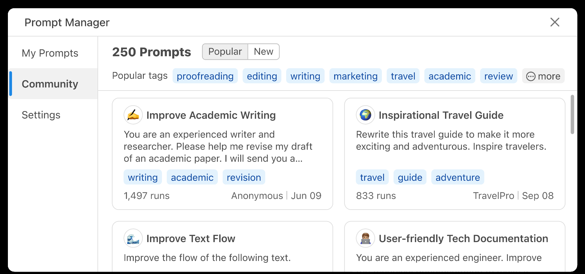
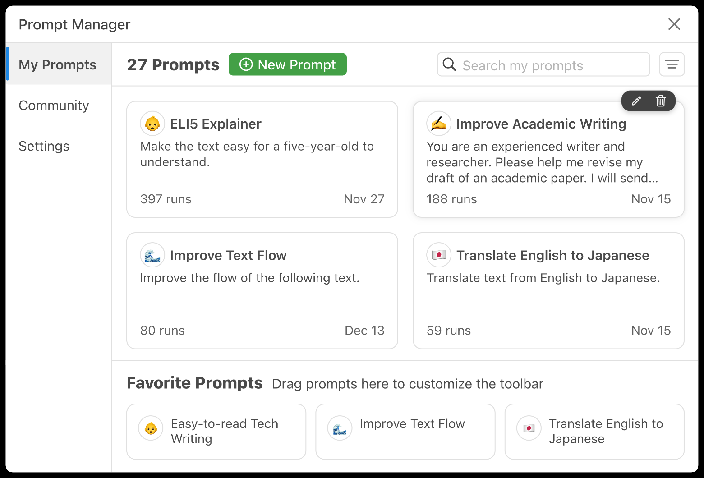
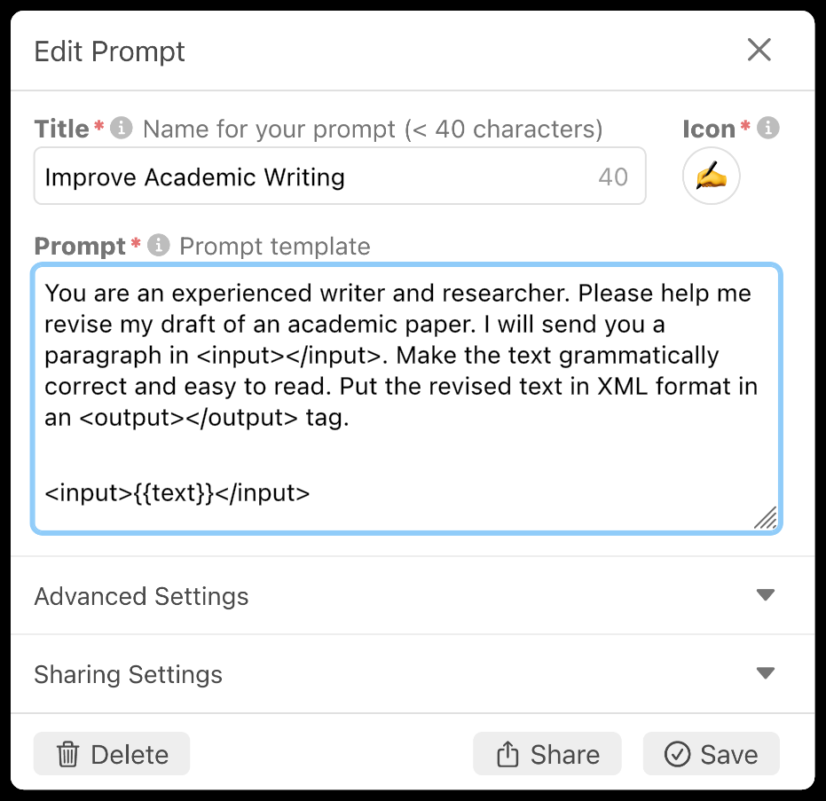
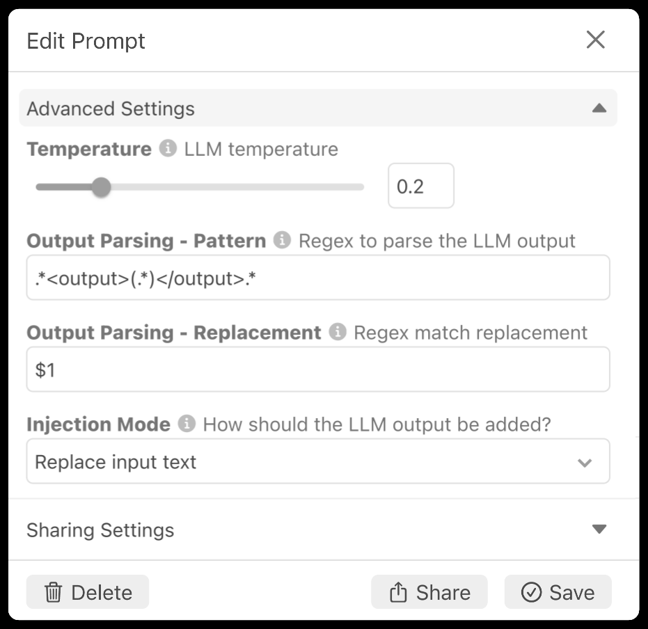
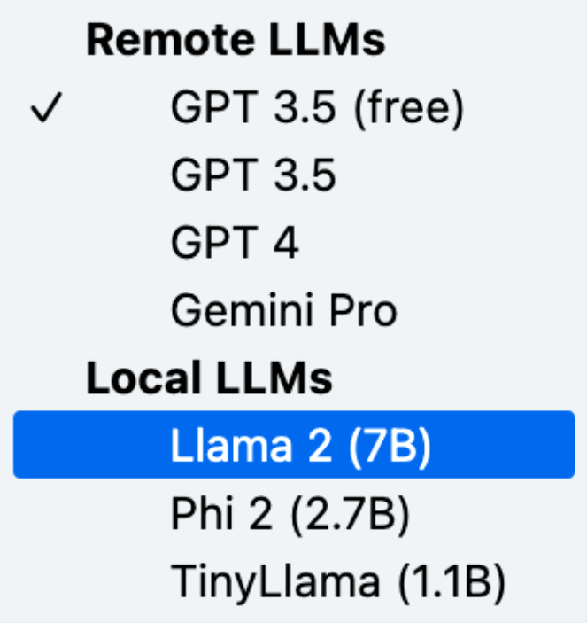
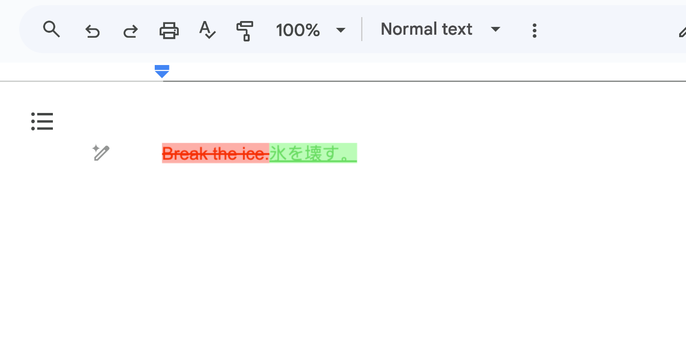
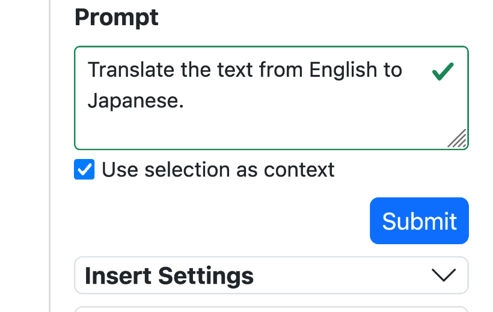

<!-- page:1 -->
# Wordflow: Social Prompt Engineering for Large Language
Models

arXiv:2401.14447v1  [cs.HC]  25 Jan 2024

Zijie J. Wang

Aishwarya
Chakravarthy

David Munechika

Duen Horng Chau

Georgia Tech
Atlanta, Georgia, USA

Fig. 1: Wordflow is an open-source social prompt engineering tool to help everyday users create, run, share, and discover
prompts for large language models (LLMs). (A) The Editor View offers an easy-to-use text editing interface, allowing users to run
an LLM prompt using the selected text as input by simply clicking on a button and examine the changes made by LLMs. (B) The
Prompt Manager enables users to edit and curate prompts, adjust LLM settings, and share their prompts with the community.

## Abstract

Large language models (LLMs) require well-crafted prompts for
effective use. Prompt engineering, the process of designing prompts,
is challenging, particularly for non-experts who are less familiar
with AI technologies. While researchers have proposed techniques
and tools to assist LLM users in prompt design, these works pri-marily target AI application developers rather than non-experts. To
address this research gap, we propose social prompt engineering,
a novel paradigm that leverages social computing techniques to
facilitate collaborative prompt design. To investigate social prompt
engineering, we introduce Wordflow, an open-source and social
text editor that enables everyday users to easily create, run, share,

and discover LLM prompts. Additionally, by leveraging modern
web technologies, Wordflow allows users to run LLMs locally
and privately in their browsers. Two usage scenarios highlight
how our tool’s incorporation of social prompt engineering can en-hance laypeople’s interactions with LLMs. Wordflow is publicly
accessible at https://poloclub.github.io/wordflow.

CCS CONCEPTS

    - • Computing methodologies →Machine learning; • Human-centered computing →Human computer interaction (HCI);
Interactive systems and tools.

KEYWORDS

Prompt Engineering, Large Language Model, Machine Learning

Permission to make digital or hard copies of part or all of this work for personal or
classroom use is granted without fee provided that copies are not made or distributed
for profit or commercial advantage and that copies bear this notice and the full citation
on the first page. Copyrights for third-party components of this work must be honored.
For all other uses, contact the owner/author(s).
arXiv, 2024, Atlanta, GA
© 2024 Copyright held by the owner/author(s).
ACM ISBN 978-x-xxxx-xxxx-x/YY/MM
https://doi.org/10.1145/nnnnnnn.nnnnnnn

ACM Reference Format:
Zijie J. Wang, Aishwarya Chakravarthy, David Munechika, and Duen Horng
Chau. 2024. Wordflow: Social Prompt Engineering for Large Language
Models. In arXiv: arXiv Preprint, 2024, Atlanta, GA. ACM, New York, NY,
USA, 8 pages. https://doi.org/10.1145/nnnnnnn.nnnnnnn

<!-- page:2 -->
1INTRODUCTION Recently, there has been a surge in the popularity of large language models (LLMs) such as GPT-4 [41], Gemini [57], and Llama 2 [59]. These pre-trained artificial intelligence (AI) models demonstrate a diverse array of capabilities that are continually being discovered, including summarization, question-answering, creative writing, and translation [11, 52]. To instruct these general-purpose LLMs to perform specific tasks, users need to provide them with prompts— text instructions and examples of desired outputs [12, 32]. These prompts serve as background contexts and guides for LLMs to generate text that aligns with users’ objectives. Prompting enables users to employ LLMs for various tasks with plain language; in fact, well-crafted prompts can make general-purpose LLMs outperform specialized AI models [40]. Designing effective prompts, known as prompt engineering, poses significant challenges for LLM users [30, 33]. LLM users often rely on trial and error and employ unintuitive patterns, such as adding “think step by step” [31] to their prompts, to successfully instruct LLMs. Prompt engineering, despite its name, is consid-ered an art [45] and is even compared to wizards learning “magic spells” [27, 65]. Prompt writers may not fully understand why cer-tain prompts work, but they still add them to their “spell books.” Furthermore, prompting is especially challenging for non-AI-experts, who are often confused about getting started and lack sufficient guidance and training on LLMs and prompting [70, 72]. There is a growing body of research on helping users prompt LLMs. Researchers propose instruction tuning [17, 61] and rein-forcement learning from human feedback [44, 53] to align a model’s output with users’ intent. Prompt techniques [e.g., 12, 40, 62] are introduced to improve LLMs’ performance on complex tasks. Li-braries [13, 35] and interactive tools [e.g., 7, 20, 30, 55, 68] have also been developed to streamline the prompt crafting process. How-ever, these techniques and tools primarily cater to AI application developers who use LLMs to build AI applications (e.g., chatbot applications), overlooking non-expert users who use LLMs for ev-eryday tasks (e.g., checking emails for grammar errors). To bridge this critical research gap, we propose social prompt engineering, a novel paradigm that leverages social computing techniques to facilitate collaborative prompt designs. We contribute:

- • Wordflow, the first social and customizable text editor
that empowers everyday users to create, run, share, and discover
LLM prompts (Fig. 1). It features a direct manipulation text edit-ing interface for applying LLM prompts to transform existing
text, such as proofreading and translation, or generate new text,
such as creative writing. Users can easily customize prompts
and LLM settings, share prompts with the community, and copy
community prompts (§ 3). Two usage scenarios highlight how
Wordflow and social prompt engineering can enhance users’
interactions with LLMs (§ 4). Finally, we discuss future research
directions for integrating workflows, fostering user engagement
and responsible AI, and evaluation (§ 5).
- • An open-source1, web-based implementation that lowers
the barrier for everyday users in designing effective prompts
and applying LLMs to their daily tasks. By leveraging modern

^{1}Wordflow code: https://github.com/poloclub/wordflow

web technologies, such as WebGPU [37, 58], our tool enables users to run cutting-edge LLMs locally without the need for dedicated backend servers or external LLM API services (§ 3.4). Additionally, we offer an open-source implementation to help future designers and researchers adopt Wordflow for exploring and developing future user interfaces for LLMs. To see a demo of Wordflow, visit https://youtu.be/3dOcVuofGVo.

Using Wordflow as a design probe, we plan to release it to the public and collect usage data to assess the effectiveness of social prompt engineering and investigate how users collaboratively craft prompts. We hope our work will inspire the design, research, and development of collaborative interfaces that help everyone more easily and effectively use LLMs.

#### 2BACKGROUND & RELATED WORK

Using LLMs by prompting. LLMs are trained to generate plau-sible output by continuing an input text, also known as a prompt. These models are pre-trained on billions of text samples from the internet, enabling them to perform various tasks specified in the prompt through auto-completion. For example, given a prompt with translation examples like “English: Hello. Spanish: Hola. English: Good luck! Spanish:”, an LLM would auto-complete it with the translation “¡Buena suerte!”, making LLMs useful for translation. Recently, LLMs have been fine-tuned using user prompts to sim-plify prompting [17, 44, 61]. To instruct an instruction-tuned LLM to translate English to Spanish, one can prompt it with “Translate the following English sentence to Spanish: Good luck!”, and the LLM would output “¡Buena suerte!”.

Challenges of prompt engineering. The accuracy of LLMs depends heavily on the prompts [33, 40]. However, prompt en-gineering, the process of crafting effective prompts, is difficult. Researchers have shown slight wording changes in the prompt can significantly impact LLM accuracy [70]. A prompt’s effectiveness can vary greatly across different models [66]. The LLM community has discovered unintuitive prompting patterns that can greatly en-hance LLMs’ performance, such as priming the LLM with phrases like “you are a translation expert” and improving LLM’s reason-ing capability with “think step by step” [31] or chain-of-thought prompting [61]. The brittleness of prompts and unintuitive prompt-ing patterns make it difficult for LLM users, especially everyday users unfamiliar with AI, to write effective prompts [70].

Addressing prompt engineering challenges. Researchers have proposed libraries such as LangChain [13], Guidance [35], and Outlines [64] to help users write prompts programmatically and control the structure of an LLM’s output. By formulating prompting as programming, researchers propose integrated de-velopment environment (IDE) features that help users edit [20] and unit test prompts [54]. Similarly, CoPrompt [19] introduces a col-laborative editor for multiple programmers to write prompts simul-taneously. AI prototyping tools like PromptMaker [30], Google AI Studio [25], OpenAI Playground [42], and PartyRock [4] allow users to rapidly write and run prompts. Leveraging visual programming techniques, AI Chains [68], PromptChainer [67], Prompt Sapper [16], and ChainForge [7] enable AI application developers to visually design and test complex prompts. Similarly,

<!-- page:3 -->

*Fig. 2: With Wordflow, users can easily manage and customize their prompts. (A) The Personal Prompt Library provides an
overview of local prompts, allowing users to search, sort, and customize the quick-action prompt toolbar in the Editor View.
(B) The Prompt Editor, activated by clicking a Prompt Card, employs progressive disclosure to help users edit basic prompt
information, advanced settings (e.g., output parsing rules and LLM temperature), and sharing configurations.*

PromptIDE [55], PromptAID [38], and Prompterator [56] em-ploy mixed-initiative and interactive visualization techniques to help LLM users brainstorm and refine prompts. These existing tools function as IDEs that help AI developers craft prompts that will later be integrated into other applications. In contrast, Wordflow aims to serve as a runtime interface for everyday users, who act as both the prompt engineers and direct users of their prompts, and may not be well-versed in AI technologies.

Social prompt engineering. Online communities, including Promptstacks [48], ChatGPT Prompt Genius [49], and ShareGPT [18], serve as platforms for prompt creators to share tips, collaborate, and stay updated on AI advancements. User prompts from social media have been scraped to create prompt datasets for AI model develop-ment [60]. Online prompt marketplaces, such as PromptBase [46], PromptHero [47] and ChatX [14], have emerged to allow users to buy and sell prompts for generative models. Midjourney’s Discord server [29] allows users to run and share prompts for text-to-image generative models, with dedicated sections for prompt critique and improvement [43]. Building on the design of these communities, Wordflow provides an easy-to-use interface that unifies creating, running, sharing, and discovering LLM prompts. The most relevant related work is PromptSource [9], an IDE for AI researchers and developers to write and share LLM prompts. PromptSource targets AI experts using LLMs for natural language processing tasks on datasets (such as data annotation), and it requires users to provide a dataset. In comparison, Wordflow targets everyday users using LLMs for daily tasks, such as grammar checking, without the need to provide any dataset.

3SYSTEM DESIGN & IMPLEMENTATION Wordflow is an interactive tool that empowers everyday users to easily create, run, share, and discover LLM prompts. It provides

an easy-to-use interface that unifies prompt creation, execution, and sharing. It tightly integrates four views: the Editor View (§ 3.1), where users can write text, run LLM prompts, and inspect changes made by LLMs; the Personal Prompt Library (§ 3.2), offering a prompt manager for creating, editing, and curating prompts locally; the Community Prompt Hub (§ 3.2), enabling users to explore and search for the latest and popular prompts shared by the community; and the Setting Panel, where users can configure LLMs to run their prompts with remote or local models (§ 3.4).

### 3.1 Editor View

When users open Wordflow in their browser or its mo-bile and desktop progressive web app, they are presented with the Editor View (Fig. 1A). This view shows a familiar text editor interface with a Floating Toolbar anchored on the right. Users can type or paste text into the editor. The Floating Toolbar consists of three prompt buttons and a home button (shown on the right). Each prompt button is represented by an emoji icon and corresponds to a prompt template. Users can click the prompt button to run its prompt using the current paragraph as the input text. If a user has selected some text, the selected text is used as the input for the prompt. Users can also click the home buttonto open a pop-up window that contains the Personal Prompt Library (§ 3.2, Fig. 2A), the Community Prompt Hub (§ 3.3, Fig. 1B), and the Setting Panel (Fig. 4).

Prompt input templating. In Wordflow, a prompt template includes pre-defined prefix text and a placeholder for the input text. For example, the prefix text can be “Improve the flow of the following text”. The input placeholder in the template serves as a variable that will be substituted with the selected text from the edi-tor. Inspired by popular prompting tools such as LangChain [13]

<!-- page:4 -->

*Fig. 3: The Prompt Editor allows users to easily configure
LLM settings such as temperature and output parsing rules.*

and PromptMaker [30], our tool supports basic prompt templat-ing. Users can include a special string {{text}} in their prompt template to represent the input placeholder (Fig. 2B), which will be replaced with the selected text from the editor before running the prompt. If the user does not include the string {{text}} in the template, the input text will be appended to the prompt template.

Prompt output parsing. To run users’ prompts, Wordflow supports remote LLM API services, such as GPT 4 [41] and Gem-ini [57] API services provided by OpenAI and Google, as well as local open-source models, such as Llama 2 [59] and Phi 2 [1]. Users can set their preferred models in the Setting Panel (Fig. 4). After receiving the output from the LLM API service or local model, the Editor View applies Myer’s diffing algorithm [21, 39] to com-pare the output text with the input text. It then highlights the changes made by the LLM (e.g., addition, replacement, and dele-tion) using different text background colors (Fig. 1A). Users can click on the highlighted text to accept or reject the changes. Inspired by LangChain, Wordflow allows users to add optional output parsing rules to a prompt by writing regular expression (regex) text (Fig. 3). For example, a user can prompt LLMs to structure the output in XML format (recommended by prompt engineering guidelines [5]), such as “Improve the flow of the following text. Put the rewritten text in an XML tag <output></output>”. The user can then add a regex pattern .*<output>(.*)</output>.* and a replacement rule $1 to parse the LLM’s output before it is displayed in the Editor View. This feature is useful for disregarding unrelated text in the LLM’s output. For instance, the output “Sure, I can help you! <output>Over recent years...</output>” will be parsed as “Over recent years...”. Furthermore, users can configure the insertion mode for each prompt. In replace mode, the input text is replaced with the LLM output, while in append mode, the LLM output is appended to the input text.

3.2 Personal Prompt Library After clicking the home button, users can open the Personal Prompt Library to manage their local prompts (Fig. 2A). This view

organizes each prompt as a Prompt Card, allowing users to easily search and sort prompts based on name, recency, and run count. To change the prompts in the Floating Toolbar (§ 3.1), users can simply drag a Prompt Card into one of the three prompt slots lo-cated in the bottom row, each corresponding to a prompt button in the Floating Toolbar. To add or edit a prompt, users can click on thebutton or a Prompt Card to open the Prompt Editor (Fig. 2B). The Prompt Editor comprises three forms: basic prompt information (Fig. 2B), optional advanced settings (Fig. 3), and optional sharing settings. In the basic prompt information sec-tion, users can configure the title, icon, and prompt template. The advanced settings allow more experienced users to set the LLM temperature, output parsing rules, and insertion rules (Fig. 3). To share a prompt with the community, users can provide a descrip-tion, tags, and recommended LLM models in the sharing settings, and then click on thebutton.

3.3 Community Prompt Hub The Community Prompt Hub enables users to easily browse and search for prompts shared by Wordflow users (Fig. 1B). Each com-munity prompt is represented as a Prompt Card and is associated with at least one tag. Users can filter prompts by clicking on a tag and can also sort prompts based on recency and popularity (i.e., the number of times they have been run). Additionally, users can view the most popular tags on the top row of this panel. By clicking on a Prompt Card, users can access the Prompt Viewer (Fig. 5) to examine detailed information provided by the prompt creator, including the title, description, prompt template, and recommended LLM models. Finally, users can click on thebutton to include a copy of the community prompt in their Personal Prompt Library (§ 3.2), where they can run the prompt, make further refinements, and potentially share it again with the community.

### 3.4 Open-source Implementation

We implement Wordflow as a progressive web app using Web Components [36] and LIT Element [23] as the fron-tend framework. Users can use Wordflow as a mobile or desk-top app by saving it as a Sa-fari Web App [6] or a Chrome app [24]. Wordflow allows users to run LLMs through re-mote API services, such as GPT 4 provided by OpenAI, or di-rectly run open-source LLMs, such as Llama 2, Phi 2, and TinyL-lama [71], in their browser (Fig. 4). We use Web LLM [58] and WebGPU [37] to implement on-device LLM inference. In Word-flow, all local prompts are stored in the local persistent storage of the user’s browser. To enable users to share community prompts, we use Amazon API Gateway [2] and DynamoDB [3] as a backend. Additionally, we provide a Google Doc add-on (Fig. 6) that allows Google Doc users to directly use Wordflow within their editor. We open source Wordflow as a collection of reusable interactive components that can be easily adopted by future researchers and designers in their interactive LLM projects.

*Fig. 4: Wordflow supports re-mote and local LLMs.*

<!-- page:5 -->

*Fig. 6: Google Doc users can directly use Wordflow’s add-on
to apply prompts to text within their Google Doc documents.*

*Fig. 5: The Prompt Viewer shows detailed information about
a community prompt. Users can click a button to copy this
prompt into their Personal Prompt Library.*

4USAGE SCENARIOS 4.1 Improving Technical Writing As a recently graduated junior software developer, Wade has been struggling with writing API documentation and system architecture descriptions. Specifically, Wade is unfamiliar with explaining tech-nical concepts in simple language that can be easily understood by different colleagues such as developers, UX designers, and program managers. One day, Wade came across a forum thread where devel-opers were sharing LLM prompts that had helped them improve their technical documentation writing. Wade had never thought about using LLM to assist him in his writing before. Intrigued, he clicked on a Wordflow prompt link shared in a popular comment on the thread. The link opened Wordflow in a new tab, displaying the Community Prompt Hub along with a pop-up showing a commu-nity prompt (Fig. 5). Wade found the prompt and its description to be suitable for his writing tasks, so he clicked on thebutton to copy this community prompt to his local library. Wade decided to try out this prompt to improve his writing. He opened the Personal Prompt Library and dragged the newly added prompt into one of the Favorite Prompts slots (Fig. 2A), and the prompt appeared in the Floating Toolbar in the Editor View (Fig. 1A). Wade copied a paragraph from the API documentation that he was working on. However, before clicking on the prompt button in the Floating Toolbar, Wade suddenly remembered that his company prohibits employees from using LLM services (e.g., ChatGPT and Bard) with work materials, as a measure to safeguard trade secrets and sensitive information. Upon reviewing the documentation of Wordflow, Wade discovered that Wordflow supports running local LLMs directly in browsers without sending any data to third-party services (e.g., OpenAI and Google). Therefore, he configured the LLM model to Llama 2, a local LLM model, in the Setting Panel before running the prompt on his writing. Then, he observed the changes made by the LLM model, which were highlighted in the Editor View, and found the new paragraph to be much easier to read.

After using this prompt for a few days, Wade shared the prompt link on his company’s mailing list, and more developers from his company began to use it to improve technical writing.

4.2 Customizing Translation Styles Ember, a senior manager in a US financial firm, has faced a new challenge since her company started collaborating with a Japanese counterpart. Due to the absence of their Japanese translator, Ember has resorted to using translation software to communicate with the managers from the Japanese company. However, she has noticed that the translations generated by the software occasionally lead to confusion among her Japanese colleagues. For example, the soft-ware translated the English idiom “break the ice” to “氷を砕く,” which means “destroy the ice” instead of her intended meaning of “relieving tension when people interact for the first time.” Due to the recent popularity of LLMs, Ember decided to try using them to translate her documents from English to Japanese. As she writes in Google Docs, she explored the Google Doc Marketplace for an AI add-on and came across Wordflow. Upon installation, she opened the Community Prompt Hub (Fig. 1B) and selected the tag, which showed various popular translation prompts. She found a prompt titled “Translate English to Japanese.” After adding this prompt to her library, she tried to run it with the input “break the ice”. However, Wordflow appended the in-correct translation “氷を砕く” to her document. Drawing from her previous experience interacting with ChatGPT, Ember decided to edit the prompt and provide additional instructions to guide the LLM model in considering her translation context. She opened the Editor View (Fig. 2B). and added a new sentence to the trans-lation prompt: “My input text is used in US corporate commu-nications” (Fig. 6 Right). Running the prompt again, Wordflow generated a more suitable translation “雰囲気を和らげる,” which means “ease the atmosphere” (Fig. 6 Left). Ember back-translated the translation to English using her other translation software and felt more confident in continuing to use this prompt for future trans-lations. Finally, to help other people who need to translate English to Japanese in business settings, she shared her updated prompt with the community by clicking on thebutton (Fig. 2B).

5DISCUSSION & FUTURE WORK While Wordflow can help users create, run, share, and discover prompts, the current system can be improved in terms of workflow integration and social system design. Finally, we plan to conduct a usage log study to evaluate social prompt engineering.

<!-- page:6 -->
Fitting into user workflows. The current version of Word-flow requires users to copy and paste their input text into a web-page or Google Doc. To minimize disruption to users’ workflow (e.g., drafting an email, replying messages, or editing a PowerPoint), future researchers can make Wordflow in situ and ubiquitous. For example, Wordflow can be directly integrated into an operat-ing system, running a prompt when users select text and trigger a keyboard shortcut. Wordflow supports both external LLM API services and on-device LLMs for running users’ prompts (§ 3.4). With recent advancements in machine learning compilation [15] and model compression [28], we see great potential for on-device LLMs. Local LLMs allow users to avoid sending sensitive data to external services, reduce API costs, and use LLMs without network access. To enhance the usability and development experience of on-device LLM tools, researchers can explore integrating local LLMs into the operating system. This integration would enable various AI tools to run LLMs as “system functions,” eliminating the need for redundant LLM installations within each tool.

Promoting user engagement. Wordflow is the first social prompt engineering tool to help everyday users create, run, and share prompts. There are great research opportunities to enhance user interaction with LLMs by leveraging social computing tech-niques. For example, future researchers can draw inspiration from gaming social platforms, such as Steam Community [51] and Poké-mon GO forums [34], where gamers engage in research and share strategies to overcome in-game challenges. By comparing prompt-ing LLMs to fighting game bosses, we can explore the design of social systems that motivate users to research and exchange prompt-ing techniques. To incentivize user participation in prompt sharing, researchers can explore intrinsic motivations, such as designing an enjoyable social system [10], and extrinsic motivations, such as virtual rewards and reputation systems [22, 69]. Lastly, Wordflow users can filter and sort prompts by tags, recency, and popularity. Researchers can explore using social media ranking techniques to recommend relevant community prompts to users [50].

Fostering responsible AI practices. It has never been more critical to address the potential harms associated with LLMs [63]. Social prompt engineering presents interesting opportunities and challenges for responsible AI. On the one hand, social systems like Wordflow can enable users to share prompting techniques [8] to mitigate potential harms. On the other hand, without content moderation, users can easily disseminate harmful prompts, such as a misinformation generator [26]. In Wordflow, users can report harmful prompts, and we will diligently monitor and moderate community prompts. Future researchers can explore social system designs that promote responsible prompting and develop methods to detect potentially harmful prompts.

Planned usage log study. Using Wordflow as a research instrument, we plan to conduct a usage log study to evaluate social prompt engineering and investigate two research questions:

RQ1. How does social prompt engineering help everyday users craft prompts?

RQ2. What do everyday users use LLMs for, and how do they write prompts?

To answer RQ1, we will examine the evolution of prompts by ana-lyzing the usage patterns of copying community prompts and the modifications made to them before re-sharing these prompts. To an-swer RQ2, we will conduct a mixed-method analysis of community prompts to synthesize popular use cases of LLMs and prompting patterns. Our institution’s IRB has approved our user study, and we will start data collection after refining the design of Wordflow.

6CONCLUSION As LLMs are increasingly being used by everyday users in their daily tasks, it is critical to help them write and run prompts easily. In this work, we present social prompt engineering, a new paradigm that leverages social computing techniques to facilitate collaborative prompt design. To investigate social prompt engineering, we design and develop Wordflow, an open-source and social text editor empowering users to easily create, run, share, and discover LLM prompts. Two usage scenarios highlight social prompt engineering and Wordflow can assist everyday users in interacting with LLMs. We discuss our ongoing work and future research directions. We hope our work will inspire the design, research, and development of social interfaces that make LLMs easy and enjoyable to use.

#### ACKNOWLEDGMENTS

This work was supported in part by an Apple Scholars in AI/ML PhD fellowship and J.P. Morgan PhD Fellowship. We are extremely grateful to Kaan Sancak, Jaemarie Solyst, Xinzhi Jiang for stress-testing our tool. We appreciate Tianqi Chen, Charlie Ruan, and Alex Cabrera for their suggestions and support for integrating on-device LLMs. We express our gratitude to Alex Bäuerle, Upol Ehsan, Muhammed Fatih Balin, Luis Morales-Navarro, Wesley Han-wen Deng, Young Wu, Giorgio Pini, Justin Blalock, Viraj Kacker, Seongmin Lee, Ben Hoover, Anthony Peng, Alec Helbling, Matthew Hull, Mansi Phute, Harsha Karanth, Pratham Mehta, Joanna Cheng, Lena Do, Smera Bhatia, Angelina Wang and Parul Pandey for their advocacy and valuable feedback.

#### REFERENCES

[1] Marah Abdin, Jyoti Aneja, Sebastien Bubeck, Caio César Teodoro Mendes, Weizhu Chen, Allie Del Giorno, Ronen Eldan, Sivakanth Gopi, Suriya Gunasekar, Mojan Javaheripi, Piero Kauffmann, Yin Tat Lee, Yuanzhi Li, Anh Nguyen, Gustavo de Rosa, Olli Saarikivi, Adil Salim, Shital Shah, Michael Santacroce, Harkirat Singh Behl, Adam Taumann Kalai, Xin Wang, Rachel Ward, Philipp Witte, Cyril Zhang, and Yi Zhang. 2023. Phi-2: The Surprising Power of Small Language Models. (2023).https://www.microsoft.com/en-us/research/blog/phi-2-the-surprising-power-of-small-language-models/ [2] Amazon. 2023. Amazon API Gateway: API Management. https://aws.amazon. com/api-gateway/ [3] Amazon. 2023. Amazon DynamoDB: Fast NoSQL Key-Value Database. https: //aws.amazon.com/dynamodb/ [4] Amazon. 2023. PartyRock: Everyone Can Build AI Apps. https://partyrock.aws/ [5] Anthropic. 2023. Introduction to Prompt Design. https://docs.anthropic.com/ claude/docs/introduction-to-prompt-design [6] Apple. 2023. Use Safari Web Apps on Mac.https://support.apple.com/en-us/104996 [7] Ian Arawjo, Chelse Swoopes, Priyan Vaithilingam, Martin Wattenberg, and Elena Glassman. 2023. ChainForge: A Visual Toolkit for Prompt Engineering and LLM Hypothesis Testing. arXiv 2309.09128 (2023). http://arxiv.org/abs/2309.09128 [8] Amanda Askell, Yuntao Bai, Anna Chen, Dawn Drain, Deep Ganguli, Tom Henighan, Andy Jones, Nicholas Joseph, Ben Mann, Nova DasSarma, Nelson Elhage, Zac Hatfield-Dodds, Danny Hernandez, Jackson Kernion, Kamal Ndousse, Catherine Olsson, Dario Amodei, Tom Brown, Jack Clark, Sam McCandlish, Chris Olah, and Jared Kaplan. 2021. A General Language Assistant as a Laboratory for Alignment. arXiv 2112.00861 (2021). http://arxiv.org/abs/2112.00861

<!-- page:7 -->
[9] Stephen Bach, Victor Sanh, Zheng Xin Yong, Albert Webson, Colin Raffel, Nihal V. Nayak, Abheesht Sharma, Taewoon Kim, M Saiful Bari, Thibault Fevry, Zaid Alyafeai, Manan Dey, Andrea Santilli, Zhiqing Sun, Srulik Ben-david, Canwen Xu, Gunjan Chhablani, Han Wang, Jason Fries, Maged Al-shaibani, Shanya Sharma, Urmish Thakker, Khalid Almubarak, Xiangru Tang, Dragomir Radev, Mike Tian-jian Jiang, and Alexander Rush. 2022. PromptSource: An Integrated Development Environment and Repository for Natural Language Prompts. In Proceedings of the 60th Annual Meeting of the Association for Computational Linguistics: System Demonstrations. https://doi.org/10.18653/v1/2022.acl-demo.9 [10] Tuba Bakici. 2020. Comparison of Crowdsourcing Platforms from Social-Psychological and Motivational Perspectives. International Journal of Information Management 54 (2020). https://doi.org/10.1016/j.ijinfomgt.2020.102121 [11] Rishi Bommasani, Drew A. Hudson, Ehsan Adeli, Russ Altman, Simran Arora, Sydney von Arx, Michael S. Bernstein, Jeannette Bohg, Antoine Bosselut, Emma Brunskill, Erik Brynjolfsson, Shyamal Buch, Dallas Card, Rodrigo Castellon, Niladri Chatterji, Annie Chen, Kathleen Creel, Jared Quincy Davis, Dora Dem-szky, Chris Donahue, Moussa Doumbouya, Esin Durmus, Stefano Ermon, John Etchemendy, Kawin Ethayarajh, Li Fei-Fei, Chelsea Finn, Trevor Gale, Lauren Gillespie, Karan Goel, Noah Goodman, Shelby Grossman, Neel Guha, Tatsunori Hashimoto, Peter Henderson, John Hewitt, Daniel E. Ho, Jenny Hong, Kyle Hsu, Jing Huang, Thomas Icard, Saahil Jain, Dan Jurafsky, Pratyusha Kalluri, Siddharth Karamcheti, Geoff Keeling, Fereshte Khani, Omar Khattab, Pang Wei Koh, Mark Krass, Ranjay Krishna, Rohith Kuditipudi, Ananya Kumar, Faisal Ladhak, Mina Lee, Tony Lee, Jure Leskovec, Isabelle Levent, Xiang Lisa Li, Xuechen Li, Tengyu Ma, Ali Malik, Christopher D. Manning, Suvir Mirchandani, Eric Mitchell, Zanele Munyikwa, Suraj Nair, Avanika Narayan, Deepak Narayanan, Ben Newman, Allen Nie, Juan Carlos Niebles, Hamed Nilforoshan, Julian Nyarko, Giray Ogut, Laurel Orr, Isabel Papadimitriou, Joon Sung Park, Chris Piech, Eva Portelance, Christo-pher Potts, Aditi Raghunathan, Rob Reich, Hongyu Ren, Frieda Rong, Yusuf Roohani, Camilo Ruiz, Jack Ryan, Christopher Ré, Dorsa Sadigh, Shiori Sagawa, Keshav Santhanam, Andy Shih, Krishnan Srinivasan, Alex Tamkin, Rohan Taori, Armin W. Thomas, Florian Tramèr, Rose E. Wang, William Wang, Bohan Wu, Jiajun Wu, Yuhuai Wu, Sang Michael Xie, Michihiro Yasunaga, Jiaxuan You, Matei Zaharia, Michael Zhang, Tianyi Zhang, Xikun Zhang, Yuhui Zhang, Lucia Zheng, Kaitlyn Zhou, and Percy Liang. 2022. On the Opportunities and Risks of Foundation Models. arXiv 2108.07258 (2022). http://arxiv.org/abs/2108.07258 [12] Tom Brown, Benjamin Mann, Nick Ryder, Melanie Subbiah, Jared D Kaplan, Prafulla Dhariwal, Arvind Neelakantan, Pranav Shyam, Girish Sastry, Amanda Askell, Sandhini Agarwal, Ariel Herbert-Voss, Gretchen Krueger, Tom Henighan, Rewon Child, Aditya Ramesh, Daniel Ziegler, Jeffrey Wu, Clemens Winter, Chris Hesse, Mark Chen, Eric Sigler, Mateusz Litwin, Scott Gray, Benjamin Chess, Jack Clark, Christopher Berner, Sam McCandlish, Alec Radford, Ilya Sutskever, and Dario Amodei. 2020. Language Models Are Few-Shot Learners. In Advances in Neural Information Processing Systems, Vol. 33. https://proceedings.neurips.cc/ paper/2020/file/1457c0d6bfcb4967418bfb8ac142f64a-Paper.pdf [13] Harrison Chase. 2022. LangChain: Building Applications with LLMs through Composability. https://github.com/langchain-ai/langchain [14] ChatX. 2023. ChatX: ChatGPT, DALL·E & Stable Diffusion Prompt Marketplace.

https://chatx.ai/ [15] Tianqi Chen, Thierry Moreau, Ziheng Jiang, Lianmin Zheng, Eddie Yan, Haichen Shen, Meghan Cowan, Leyuan Wang, Yuwei Hu, Luis Ceze, Carlos Guestrin, and Arvind Krishnamurthy. 2018. TVM: An Automated End-to-End Optimizing Compiler for Deep Learning. In 13th USENIX Symposium on Operating Systems De-sign and Implementation (OSDI 18). https://www.usenix.org/conference/osdi18/ presentation/chen [16] Yu Cheng, Jieshan Chen, Qing Huang, Zhenchang Xing, Xiwei Xu, and Qinghua Lu. 2023. Prompt Sapper: A LLM-Empowered Production Tool for Building AI Chains. arXiv 2306.12028 (2023). http://arxiv.org/abs/2306.12028 [17] Hyung Won Chung, Le Hou, Shayne Longpre, Barret Zoph, Yi Tay, William Fedus, Yunxuan Li, Xuezhi Wang, Mostafa Dehghani, Siddhartha Brahma, Albert Web-son, Shixiang Shane Gu, Zhuyun Dai, Mirac Suzgun, Xinyun Chen, Aakanksha Chowdhery, Alex Castro-Ros, Marie Pellat, Kevin Robinson, Dasha Valter, Sharan Narang, Gaurav Mishra, Adams Yu, Vincent Zhao, Yanping Huang, Andrew Dai, Hongkun Yu, Slav Petrov, Ed H. Chi, Jeff Dean, Jacob Devlin, Adam Roberts, Denny Zhou, Quoc V. Le, and Jason Wei. 2022. Scaling Instruction-Finetuned Language Models. arXiv 2210.11416 (2022). http://arxiv.org/abs/2210.11416 [18] Dom Eccleston and Steven Tey. 2022. ShareGPT: Share Your Wildest ChatGPT Conversations with One Click. https://sharegpt.com [19] Felicia Li Feng, Ryan Yen, Yuzhe You, Mingming Fan, Jian Zhao, and Zhicong Lu. 2023. CoPrompt: Supporting Prompt Sharing and Referring in Collaborative Natural Language Programming. arXiv 2310.09235 (2023). http://arxiv.org/abs/ 2310.09235 [20] Alexander J. Fiannaca, Chinmay Kulkarni, Carrie J Cai, and Michael Terry. 2023. Programming without a Programming Language: Challenges and Opportunities for Designing Developer Tools for Prompt Programming. In Extended Abstracts of the 2023 CHI Conference on Human Factors in Computing Systems.https: //doi.org/10.1145/3544549.3585737

[21] Neil Fraser. 2012. Diff-Match-Patch: Hgh-performance Library in Multiple Lan-guages That Manipulates Plain Text. https://github.com/google/diff-match-patch [22] Dion Hoe-Lian Goh, Ei Pa Pa Pe-Than, and Chei Sian Lee. 2017. Perceptions of Virtual Reward Systems in Crowdsourcing Games. Computers in Human Behavior 70 (2017). https://doi.org/10.1016/j.chb.2017.01.006 [23] Google. 2020. Lit: Simple Fast Web Components. https://lit.dev/ [24] Google. 2022. Add and Open Chrome Apps. https://support.google.com/chrome_ webstore/answer/3060053?hl=en [25] Google. 2023. Google AI Studio. https://makersuite.google.com/app/prompts/ new_freeform [26] Hans W. A. Hanley and Zakir Durumeric. 2023. Machine-Made Media: Monitoring the Mobilization of Machine-Generated Articles on Misinformation and Main-stream News Websites. arXiv 2305.09820 (2023). http://arxiv.org/abs/2305.09820 [27] Drew Harwell. 2023. Tech’s Hottest New Job: AI Whisperer. No Coding Re-quired.https://www.washingtonpost.com/technology/2023/02/25/prompt-engineers-techs-next-big-job/ [28] Fred Hohman, Mary Beth Kery, Donghao Ren, and Dominik Moritz. 2023. Model Compression in Practice: Lessons Learned from Practitioners Creating On-device Machine Learning Experiences. arXiv 2310.04621 (2023). http://arxiv.org/abs/ 2310.04621 [29] David Holz. 2022. Midjourney: Exploring New Mediums of Thought and Expand-ing the Imaginative Powers of the Human Species. https://www.midjourney.com [30] Ellen Jiang, Kristen Olson, Edwin Toh, Alejandra Molina, Aaron Donsbach, Michael Terry, and Carrie J Cai. 2022. PromptMaker: Prompt-based Prototyping with Large Language Models. In CHI Conference on Human Factors in Computing Systems Extended Abstracts. https://doi.org/10.1145/3491101.3503564 [31] Takeshi Kojima, Shixiang (Shane) Gu, Machel Reid, Yutaka Matsuo, and Yusuke Iwasawa. 2022. Large Language Models Are Zero-Shot Reasoners.Advances in Neural Information Processing Systems35 (2022).https://proceedings.neurips.cc/paper_files/paper/2022/hash/ 8bb0d291acd4acf06ef112099c16f326-Abstract-Conference.html [32] Patrick Lewis, Ethan Perez, Aleksandra Piktus, Fabio Petroni, Vladimir Karpukhin, Naman Goyal, Heinrich Küttler, Mike Lewis, Wen-tau Yih, Tim Rocktäschel, Sebastian Riedel, and Douwe Kiela. 2021. Retrieval-Augmented Generation for Knowledge-Intensive NLP Tasks. arXiv 2005.11401 (2021). http://arxiv.org/abs/ 2005.11401 [33] Pengfei Liu, Weizhe Yuan, Jinlan Fu, Zhengbao Jiang, Hiroaki Hayashi, and Graham Neubig. 2023. Pre-Train, Prompt, and Predict: A Systematic Survey of Prompting Methods in Natural Language Processing. Comput. Surveys 55 (2023). https://doi.org/10.1145/3560815 [34] Enrica Loria, Alessia Antelmi, and Johanna Pirker. 2021. Comparing the Structures and Characteristics of Different Game Social Networks - The Steam Case. In 2021 IEEE Conference on Games (CoG). https://doi.org/10.1109/CoG52621.2021.9619130 [35] Scott Lundberg, Marco Tulio Ribeiro, and Harsha Nori. 2023. Guidance: A Guidance Language for Controlling Large Language Models.guidance-ai. https://github.com/guidance-ai/guidance [36] MDN. 2021. Web Components - Web APIs.https://developer.mozilla.org/en-US/docs/Web/API/Web_components [37] MDN. 2023. WebGPU API - Web APIs.https://developer.mozilla.org/en-US/ docs/Web/API/WebGPU_API [38] Aditi Mishra, Utkarsh Soni, Anjana Arunkumar, Jinbin Huang, Bum Chul Kwon, and Chris Bryan. 2023. PromptAid: Prompt Exploration, Perturbation, Testing and Iteration Using Visual Analytics for Large Language Models. arXiv 2304.01964 (2023). http://arxiv.org/abs/2304.01964 [39] Eugene W Myers. 1986. An O (ND) Difference Algorithm and Its Variations. Algorithmica. An International Journal in Computer Science 1 (1986). [40] Harsha Nori, Yin Tat Lee, Sheng Zhang, Dean Carignan, Richard Edgar, Nicolo Fusi, Nicholas King, Jonathan Larson, Yuanzhi Li, Weishung Liu, Renqian Luo, Scott Mayer McKinney, Robert Osazuwa Ness, Hoifung Poon, Tao Qin, Naoto Usuyama, Chris White, and Eric Horvitz. 2023. Can Generalist Foundation Models Outcompete Special-Purpose Tuning? Case Study in Medicine. arXiv 2311.16452 (2023). http://arxiv.org/abs/2311.16452 [41] OpenAI. 2023. GPT-4 Technical Report. arXiv 2303.08774 (2023). http://arxiv. org/abs/2303.08774 [42] OpenAI. 2023. OpenAI Playground. https://platform.openai.com/playground [43] Jonas Oppenlaender. 2022. A Taxonomy of Prompt Modifiers for Text-To-Image Generation. arXiv 2204.13988 (2022). http://arxiv.org/abs/2204.13988 [44] Long Ouyang, Jeff Wu, Xu Jiang, Diogo Almeida, Carroll L. Wainwright, Pamela Mishkin, Chong Zhang, Sandhini Agarwal, Katarina Slama, Alex Ray, John Schul-man, Jacob Hilton, Fraser Kelton, Luke Miller, Maddie Simens, Amanda Askell, Peter Welinder, Paul Christiano, Jan Leike, and Ryan Lowe. 2022. Training Lan-guage Models to Follow Instructions with Human Feedback. arXiv 2203.02155 (2022). http://arxiv.org/abs/2203.02155 [45] Aditya G. Parameswaran, Shreya Shankar, Parth Asawa, Naman Jain, and Yujie Wang. 2023. Revisiting Prompt Engineering via Declarative Crowdsourcing. arXiv 2308.03854 (2023). http://arxiv.org/abs/2308.03854 [46] PromptBase. 2023. PromptBase: Prompt Marketplace: Midjourney, ChatGPT, DALL·E, Stable Diffusion & More. https://promptbase.com

<!-- page:8 -->
[47] PromptHero. 2023. PromptHero: Search Prompts for Stable Diffusion, ChatGPT & Midjourney. https://prompthero.com/ [48] Promptstacks. 2023. Promptstacks: Your Prompt Engineering Community. https: //www.promptstacks.com/ [49] Reddit. 2023.R/ChatGPTPromptGenius.https://www.reddit.com/r/ ChatGPTPromptGenius/ [50] Badrul Sarwar, George Karypis, Joseph Konstan, and John Riedl. 2001. Item-Based Collaborative Filtering Recommendation Algorithms. In Proceedings of the 10th International Conference on World Wide Web.https://doi.org/10.1145/371920. 372071 [51] Shavneet Sharma, Neale Slack, Kritika Devi, Tuma Greig, and Samantha Naidu. 2021. Exploring Gamers’ Crowdsourcing Engagement in Pokémon Go Commu-nities. The TQM Journal (2021). https://doi.org/10.1108/TQM-05-2021-0131 [52] Aarohi Srivastava, Abhinav Rastogi, Abhishek Rao, Abu Awal Md Shoeb, Abubakar Abid, Adam Fisch, Adam R Brown, Adam Santoro, Aditya Gupta, Adrià Garriga-Alonso, et al. 2022. Beyond the Imitation Game: Quantifying and Ex-trapolating the Capabilities of Language Models. arXiv preprint arXiv:2206.04615 (2022). http://arxiv.org/abs/2206.04615 [53] Nisan Stiennon, Long Ouyang, Jeff Wu, Daniel M. Ziegler, Ryan Lowe, Chelsea Voss, Alec Radford, Dario Amodei, and Paul Christiano. 2020. Learning to Sum-marize from Human Feedback. arXiv:2009.01325 [cs] (2020). http://arxiv.org/abs/ 2009.01325 [54] Hendrik Strobelt. 2023. Prompt Tester - Quick Prompt Iterations for Ad-Hoc Tasks. https://prompt-tester.vizhub.ai/blog [55] Hendrik Strobelt, Albert Webson, Victor Sanh, Benjamin Hoover, Johanna Beyer, Hanspeter Pfister, and Alexander M. Rush. 2022. Interactive and Visual Prompt Engineering for Ad-hoc Task Adaptation With Large Language Models. IEEE Transactions on Visualization and Computer Graphics (2022). https://doi.org/10. 1109/TVCG.2022.3209479 [56] Samuel Sučik, Daniel Skala, Andrej Švec, Peter Hraška, and Marek Šuppa. 2023. Prompterator: Iterate Efficiently towards More Effective Prompts. In Proceedings of the 2023 Conference on Empirical Methods in Natural Language Processing: System Demonstrations. https://doi.org/10.18653/v1/2023.emnlp-demo.43 [57] Gemini Team, Rohan Anil, Sebastian Borgeaud, Yonghui Wu, Jean-Baptiste Alayrac, Jiahui Yu, Radu Soricut, Johan Schalkwyk, Andrew M Dai, Anja Hauth, et al. 2023. Gemini: A Family of Highly Capable Multimodal Models. arXiv preprint arXiv:2312.11805 (2023). https://arxiv.org/abs/2312.11805 [58] MLC team. 2023. MLC-LLM. https://github.com/mlc-ai/mlc-llm [59] Hugo Touvron, Louis Martin, Kevin Stone, Peter Albert, Amjad Almahairi, Yas-mine Babaei, Nikolay Bashlykov, Soumya Batra, Prajjwal Bhargava, Shruti Bhos-ale, Dan Bikel, Lukas Blecher, Cristian Canton Ferrer, Moya Chen, Guillem Cucu-rull, David Esiobu, Jude Fernandes, Jeremy Fu, Wenyin Fu, Brian Fuller, Cynthia Gao, Vedanuj Goswami, Naman Goyal, Anthony Hartshorn, Saghar Hosseini, Rui Hou, Hakan Inan, Marcin Kardas, Viktor Kerkez, Madian Khabsa, Isabel Kloumann, Artem Korenev, Punit Singh Koura, Marie-Anne Lachaux, Thibaut Lavril, Jenya Lee, Diana Liskovich, Yinghai Lu, Yuning Mao, Xavier Martinet, Todor Mihaylov, Pushkar Mishra, Igor Molybog, Yixin Nie, Andrew Poulton, Jeremy Reizenstein, Rashi Rungta, Kalyan Saladi, Alan Schelten, Ruan Silva, Eric Michael Smith, Ranjan Subramanian, Xiaoqing Ellen Tan, Binh Tang, Ross Taylor, Adina Williams, Jian Xiang Kuan, Puxin Xu, Zheng Yan, Iliyan Zarov,

Yuchen Zhang, Angela Fan, Melanie Kambadur, Sharan Narang, Aurelien Ro-driguez, Robert Stojnic, Sergey Edunov, and Thomas Scialom. 2023. Llama 2: Open Foundation and Fine-Tuned Chat Models. arXiv 2307.09288 (2023). [60] Zijie J. Wang, Evan Montoya, David Munechika, Haoyang Yang, Benjamin Hoover, and Duen Horng Chau. 2023. DiffusionDB: A Large-Scale Prompt Gallery Dataset for Text-to-Image Generative Models. In Proceedings of the 61st Annual Meeting of the Association for Computational Linguistics (Volume 1: Long Papers). https: //aclanthology.org/2023.acl-long.51 [61] Jason Wei, Maarten Bosma, Vincent Y. Zhao, Kelvin Guu, Adams Wei Yu, Brian Lester, Nan Du, Andrew M. Dai, and Quoc V. Le. 2022. Finetuned Language Models Are Zero-Shot Learners. arXiv 2109.01652 (2022). http://arxiv.org/abs/2109.01652 [62] Jason Wei, Xuezhi Wang, Dale Schuurmans, Maarten Bosma, brian ichter, Fei Xia, Ed Chi, Quoc V Le, and Denny Zhou. 2022. Chain-of-Thought Prompting Elicits Reasoning in Large Language Models. In Advances in Neural Information Processing Systems, Vol. 35. https://proceedings.neurips.cc/paper_files/paper/ 2022/file/9d5609613524ecf4f15af0f7b31abca4-Paper-Conference.pdf [63] Laura Weidinger, Maribeth Rauh, Nahema Marchal, Arianna Manzini, Lisa Anne Hendricks, Juan Mateos-Garcia, Stevie Bergman, Jackie Kay, Conor Griffin, Ben Bariach, Iason Gabriel, Verena Rieser, and William Isaac. 2023. Sociotechnical Safety Evaluation of Generative AI Systems. arXiv 2310.11986 (2023).http: //arxiv.org/abs/2310.11986 [64] Brandon T. Willard and Rémi Louf. 2023. Efficient Guided Generation for Large Language Models. arXiv 2307.09702 (2023). http://arxiv.org/abs/2307.09702 [65] Simon Willison, Adam Stacoviak, and Jerod Stacoviak. 2022. Stable Diffusion Breaks the Internet. https://changelog.com/podcast/506 [66] Max Woolf. 2023. The Problem With LangChain. https://minimaxir.com/2023/ 07/langchain-problem/ [67] Tongshuang Wu, Ellen Jiang, Aaron Donsbach, Jeff Gray, Alejandra Molina, Michael Terry, and Carrie J Cai. 2022. PromptChainer: Chaining Large Language Model Prompts through Visual Programming. In CHI Conference on Human Factors in Computing Systems Extended Abstracts. https://doi.org/10.1145/3491101. 3519729 [68] Tongshuang Wu, Michael Terry, and Carrie Jun Cai. 2022. AI Chains: Transparent and Controllable Human-AI Interaction by Chaining Large Language Model Prompts. In CHI Conference on Human Factors in Computing Systems.https: //doi.org/10.1145/3491102.3517582 [69] Wei Wu and Xiang Gong. 2020. Motivation and Sustained Participation in the Online Crowdsourcing Community: The Moderating Role of Community Commitment. Internet Research 31 (2020). https://doi.org/10.1108/INTR-01-2020-0008 [70] J.D. Zamfirescu-Pereira, Richmond Y. Wong, Bjoern Hartmann, and Qian Yang. 2023. Why Johnny Can’t Prompt: How Non-AI Experts Try (and Fail) to Design LLM Prompts. In Proceedings of the 2023 CHI Conference on Human Factors in Computing Systems. https://doi.org/10.1145/3544548.3581388 [71] Peiyuan Zhang, Guangtao Zeng, Tianduo Wang, and Wei Lu. 2024. TinyLlama: An Open-Source Small Language Model. arXiv 2401.02385 (2024). http://arxiv. org/abs/2401.02385 [72] Zhongyi Zhou, Jing Jin, Vrushank Phadnis, Xiuxiu Yuan, Jun Jiang, Xun Qian, Jingtao Zhou, Yiyi Huang, Zheng Xu, Yinda Zhang, Kristen Wright, Jason Mayes, Mark Sherwood, Johnny Lee, Alex Olwal, David Kim, Ram Iyengar, Na Li, and Ruofei Du. 2023. InstructPipe: Building Visual Programming Pipelines with Human Instructions. arXiv 2312.09672 (2023). http://arxiv.org/abs/2312.09672

